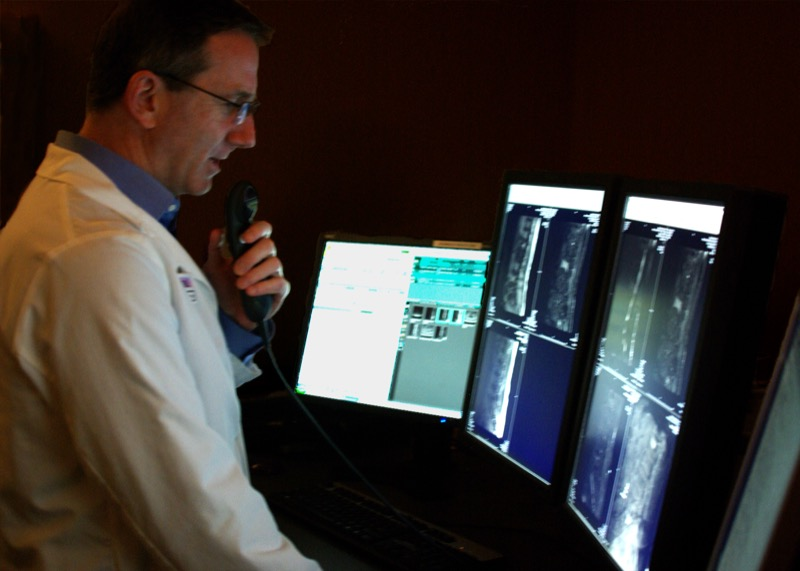

##Are radiologists being replaced by AI?
 
The frightening, futurist portrayals of artificial intelligence and anthropomorphic robots portended in Hollywood films and sci-fi novels are fictional. In reality, AI is already changing our everyday lives, almost entirely in ways that benefit our society. Apple’s Siri, voice recognition, Google’s ability to recognize photos and videos of cats, weather forecasts, and email spam filtering, are all examples. Indeed, we’ve witnessed quantum leaps in the quantity and quality of a wide range of common technologies. 
 
This exponential growth in the commercial use of AI in has prompted concerns about a dark dystopian future in which computers will replace humans for many tasks, including specialties for which people train for years to become proficient – like in medicine. 
 
At the 2016 Machine Learning and the Market for Intelligence conference, AI pioneer and researcher Geoffrey Hinton made a controversial statement regarding the future progress in the field of machine learning in areas like medicine. Hinton [said](https://www.youtube.com/watch?v=2HMPRXstSvQ&feature=youtu.be&t=29): 
“If you work as a radiologist you’re like the coyote that’s already over the edge of the cliff. People should stop training radiologists now, it’s just completely obvious that in five years deep learning is going to do better than radiologists, it might be ten years”. 
 
Although Hinton said "it might be ten years," he is still making a pretty serious prediction. Is it a crazy notion? Not entirely. Throughout history, from the invention of the wheel to the Gutenberg press, technology has replaced forms of human labor. Although machines have stepped in to perform relatively low-skill, low-wage, highly repetitive work, automation and AI-based technology can eventually replace white-collar professions, like medical technicians or even doctors.
 
Hinton's statement predicts that there will be a groundbreaking disruption of a professional occupation. So how do we even judge a claim like this? Perhaps a good place to start is to understand what radiologists do.
 
###What is radiology? What do radiologists do?
A radiologist is an imaging expert with specialized training in interpreting medical images obtained through x-rays, ultrasound, the use of radioactive substances (such as in nuclear medicine), or the body's natural magnetism (MRI). Some radiologists have procedural specialties such as treating diseases utilizing radiation and performing image-guided surgery.  A radiologist correlates her findings from medical images with other examinations and tests to render a diagnosis.  
 
I should also note that a typical radiologist has at least ten years of medical training, and usually five in radiology specifically. Given this information about radiologists, is it "completely obvious" that deep learning is going to outperform radiologists? Should we stop training radiologists?
 
To start, relatively repetitive tasks will likely be automated such as the search for a rib fracture or lung nodules or pulmonary emboli on CT, [maximum standardized uptake value (SUVmax)] assessment on PET, and multisequence MRI analysis and comparison. But does that necessarily replace the job of radiologists? 
 
###Current state of AI in Radiology
While humans have a remarkable visual system and radiologists have the ability to learn and memorize patterns, modern imaging technology is creating image datasets that exceed human pattern recognition capabilities. Due to advancements in deep learning and computer vision, algorithms can process data and become capable of learning incredibly complex, multi-dimensional patterns derived from variable populations.  Moreover, with more data, algorithms can evolve and increase their accuracy. 
 
According to a study published in the [Journal of Radiology](http://pubs.rsna.org/doi/full/10.1148/radiol.2016161315), an AI system was able to predict the survival of patients with pulmonary hypertension, a condition that leads to heart failure if not treated appropriately. The researchers from the Imperial College of London used historical data of 250 patients to feed into their system, which automatically analyzed the moving images of a patient’s heart captured during an MRI scan. By measuring the movement of 30,000 different points in the lung's structure for every heartbeat, the algorithm learned the features of cardiac function that best predict heart failure and death. 
 
In another study, researchers from Thomas Jefferson University Hospital in Philadelphia applied deep learning methods to chest X-rays and were able to identify cases of TB with an accuracy of 96 percent. For the study, which was published in the Journal of Radiology, researchers obtained 1,007 X-rays of patients with and without active TB, which were then split into sets: training (68.0 percent), validation (17.1 percent), and test (14.9 percent). The different cases were used to train two different DCNN models – AlexNet and GoogLeNet – which learned from TB-positive and TB-negative X-rays. The researchers then tested the model's’ accuracy on 150 cases that were excluded from the training and validation datasets. They found that a combination of the AlexNet and GoogLeNet models resulted in the best performance, with a net accuracy of 96 percent.  The researchers also noted that one of the implications is that AI can help make diagnoses of serious diseases in areas that lack radiologists.
 
Machines will not only be able to analyze large complex datasets with rapid efficiency, but also with more accuracy. According to [The BMJ](http://www.bmj.com/content/353/bmj.i2139), medical error is the third leading cause of death in the U.S.-- behind heart disease and cancer. But imagine a world where medical errors were a thing of the past due to the dawn of AI technology. In medicine, AI can potentially reduce the number of medical errors, as well as provide a host of other benefits. Indeed, AI technology has been shown to cut diagnostic error rates. 
 
###Human variability in medicine
One of the big challenges in healthcare is the variation in how physicians practice medicine. For many senior doctors, the knowledge and decision-making comes [automatically](https://www.ncbi.nlm.nih.gov/pubmed/2261032), which means that they don’t really think about their decisions. There is no “general” system to interpret radiographs and patient history to arrive at a diagnosis. When confronted with the same patient or the same image, many doctors don't reach the same conclusion and, consequently, may prescribe different treatments. Perhaps this is due to the qualitative aspects of medicine, where "best practices" can have different meanings, depending on the doctor, medical facility, etc. For these reasons, patient data can be messy-- a patient’s condition can change within a heartbeat; measurements can become more or less important. Also, there is so much perception that goes into medical image analysis that the outcome is known to suffer from a lack of consistency and reproducibility. 
 
Machine learning algorithms require huge amounts of data to reach acceptable performance levels, but the the quality and quantity of data is compounded due variable nature of patient data. Biases in data collection can also affect an algorithm’s performance and generalizability. Moreover, the lack of data sharing due to privacy issues suggests that there’s no streamlined access to medical data.
 
###Why Hinton Might Be Wrong
Going back to Hinton’s statement, he predicts that machine learning will become better than radiologists in five to ten years. But will they be better than all radiologists, across all medical facilities? It’s hard to say. Machine learning needs a good ground-truth, which means that training data needs to be labeled correctly. However, this is harder said than done, because doctors don’t always agree with each other. 
 
In a way, Hinton’s statement implies that the role of radiologists does not go beyond the realm of pattern recognition. However, in reality, interpreting images is just one part of the average radiologist's responsibilities. Their scope also includes patient communication, image quality assessment and optimization, education, procedures, policy making, and more. In this sense, radiologists will likely utilize AI as a tool so that they can focus on other things, such as spending more time with patients.
 
###Conclusion
 
Technology always put existing jobs under strain. This doesn’t immediately mean all radiologists are under threat. Generally other professions grow to fill the loss, often creating more jobs than the ones that are lost. Perhaps, the increasing role of AI technologies in medical fields like radiology will turn radiologists into information specialists. Because human judgment and feedback will remain integral to improving machine learning systems in healthcare. 
 
In the end, AI will likely improve the quality of patient care. As algorithms for machine learning continue to rapidly improve, AI-based applications could dramatically improve the ability of physicians to establish a prognosis, as well as increase diagnostic accuracy. But it might be decades before computers become first-line decision makers.
