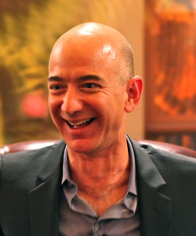
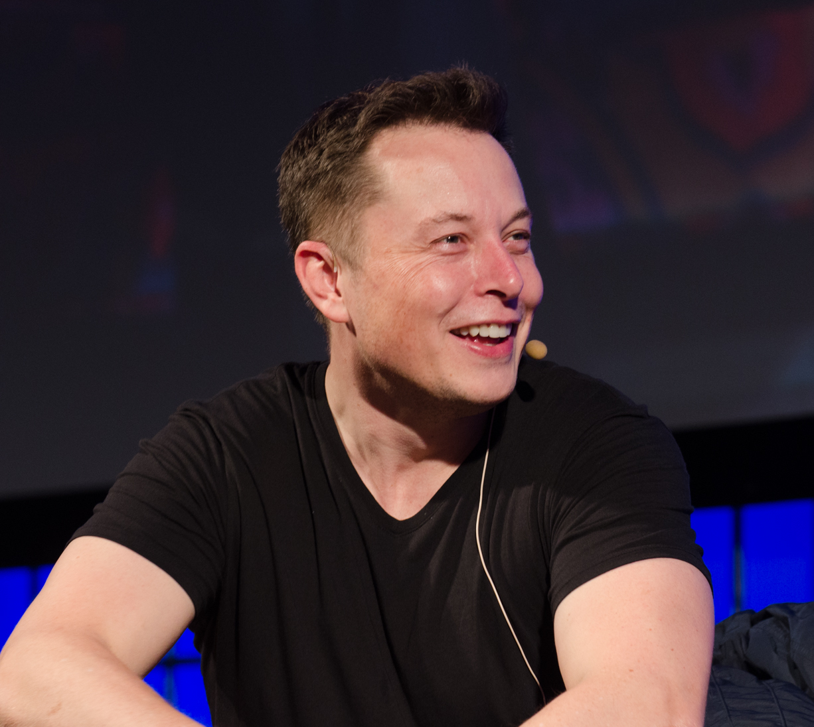
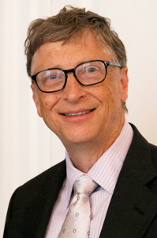
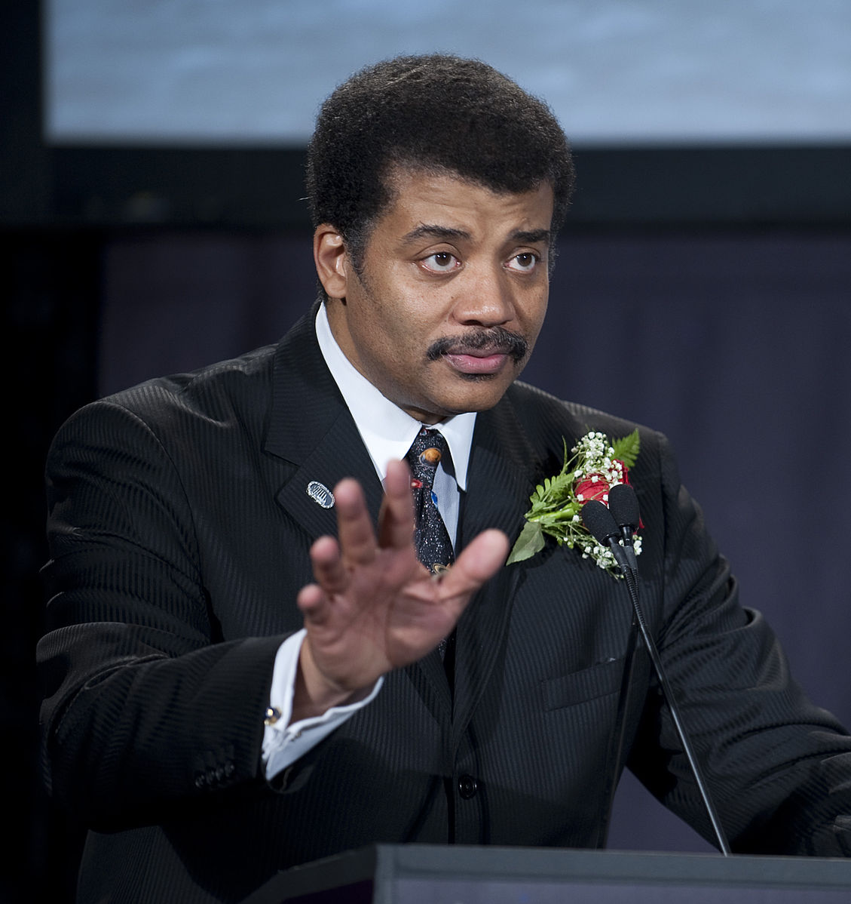
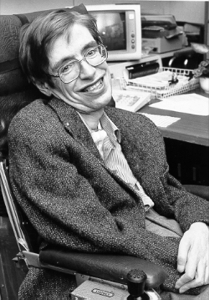

## Outspoken on AI

You may or may not agree with some or all of the perspectives featured here, but regardless, 

### Jeff Bezos

Jeff Bezos is one of the chief executive officers advocating for the development of AI. Unlike other CEOs, he does not see AI as a threat; instead, he thinks that AI can be beneficial for every business.

He also thinks of machine learning and AI as "enabling layers" that will empower and improve every business, every organization, every government, and every philanthropy. He believes that there is no institution in the world that cannot be improved with machine learning.

The Amazon CEO said that a "tremendous amount" of AI and machine learning has been used to develop their "interesting" products such as Echo, Alexa, and Prime Air delivery drones. He also said that his company is making AI techniques accessible for the enterprise customer through Amazon Web Services.

Amazon is one of several tech giants using and offering artificial intelligence technologies. One of their product, Amazon web services offers artificial intelligence services via the cloud. It is well known as the top public cloud vendor which makes the company to be reckoned with in machine learning and artificial intelligence.

### Elon Musk

"I think people should be really concerned by it," Elon Musk [said](https://www.cnbc.com/2017/12/18/9-mind-blowing-things-elon-musk-said-about-robots-and-ai-in-2017.html) about Artificial Intelligence (AI) at the National Governors Association. He continued to say that AI constitutes a fundamental risk to the existence of human civilization.  Elon Musk thinks that more control and the democratization of A.I. are issues that need to be addressed. His initiative [Neuralink](https://www.theverge.com/2017/3/27/15077864/elon-musk-neuralink-brain-computer-interface-ai-cyborgs) works on a merger between human brains and A.I. to address the &lsquo;control problem.' Meanwhile, his companies [OpenAI](https://openai.com/about/) and Tesla A.I. are developing ways for A.I. to benefit all of humanity.  Musk believes that, regardless of the intentions behind its development, A.I. will lead us to our destruction. More specifically, he believes that we should forget the idea of killer robots. During an [interview with Vanity Fair](https://www.vanityfair.com/news/2017/03/elon-musk-billion-dollar-crusade-to-stop-ai-space-x) last year, he said that &ldquo;it's not the robot; it's the computer algorithm in the Net&hellip; if there's large, centralized AI that decides, there's no stopping it.&rdquo; While Musk recognizes that the top technologists of the Silicon Valley are taking AI far more seriously, he recognizes that AI could lead us to the [third world war](http://mashable.com/2017/09/04/elon-musk-ai-world-war-3/).

### Bill Gates

The discussions around artificial intelligence and robotics have been around for a long time, and the world has been exposed to movies with life-like robots as part of the cast for decades. Artificial intelligence is not only about robotics, but any form of intelligence shown by a machine which has cognitive abilities such as that of humans including the ability to solve problems and to learn.

Today, some of the major examples of A.I. are DeepMind, Alexa and Siri that were introduced by Google, Amazon and Apple respectively. And A.I. is expected to evolve further. Hence, by the time the robotics will be beyond manufacturing sectors, the combination of the current major examples of A.I. will just form a small segment of the potential of modern technology.

There are different reactions on the advancements of A.I.; some scared of it while others embrace it. Bill Gates, the Co-founder of Microsoft, supports technological advancements but wants the control of earth to remain in the hands of mankind. He publicly expressed his desire to witness the development of A.I. to the extent where computers can understand information in a similar manner as humans. But the former richest man on earth further elaborated that there is a need for humans to be worried about the threat posed by AI.

### Hillary Clinton

Although not completely opposed to the use of A.I., Clinton is wary of the dangers that A.I. poses and believes that we are not sufficiently prepared for the challenges. It is not world domination by super smart robots that she fears (at least, she has nothing to say on that subject), but the more practical problems, such as the inevitable rise in unemployment once more intelligent machines start doing more and more of the jobs that we are used to doing ourselves.

Clinton mentions the plight of drivers &ndash; taxi drivers, Uber drivers, and delivery people &ndash; once driverless cars become common and the people who once were needed to drive these vehicles are no longer required to do so. She also finds A.I. troubling in another aspect &ndash; she is concerned about the loss of individual privacy that the internet of things most probably entails.  
After all, in a world in which everybody and everybody's coffee maker is hooked up to the worldwide net, what is the difference between public and private? There is a lot of potential here for misuse, for taking advantage of citizens. Clinton does not deny the possible benefits, but says that had she been elected, she would have formed a committee of experts in order to form policy on A.I.

### Neil deGrasse Tyson

Many business tycoons and world leaders have expressed fear about AI taking over the world. People like Bill Gates, Stephen Hawking, Elon Musk and other philanthropists have hinted concern and fear for the future of the human race.

But one man, Neil deGrasse Tyson, refuses to accept it. He is not convinced that the existence of AI is a threat to the human race. Instead, Tyson believes that people are afraid of lack of emotion, which to him, is pointless. Emotions are programmable instincts that evolution codes into living things. And no one would be motivated to lift a finger to do things without them, and same goes for an AI.

According to Tyson, humans will not be stupid to build and program AI's with animal emotions, and if we don't then there is no reason to worry because they won't have or exhibit them. And even though some scientists would attempt to build AI's with one, such won't appeal to users or bring any return on investment.

How the human mind works is still a concept scientist are yet to fully understand science. Being an expert in theoretical physics or computer technology doesn't change anything. You will be surprised to know that many experts talking about the dangers of AI don't even know half the equation. And that is why many of them predict that a human equivalent of the artificial intelligence can be created. Even though they claim to be acquainted with the technological details, they still do not understand how to build the machine to the human intelligence level. Hence, the fear of AI taking over the world is unnecessary according to Tyson.

### Steven Hawking

Steven Hawking has always been held in high regard concerning his scientific and philosophical perspectives. One area where he has been very vocal is artificial intelligence. It is noted that Hawking is a beneficiary of this advancement in technology. He currently has amyotrophic lateral sclerosis, a condition that has left him paralyzed and unable to speak or move without the help of technology. Artificial intelligence now plays a significant role in his life. However, he has stated that it could be the worst event in the history of our civilization.

Hawking thinks the broad range of applications of A.I. has value. For example, A.I. can be leveraged to fight and prevent diseases, or help alieve global issues like poverty and natural disasters. He has even acknowledged that it might be the most significant development in human history. But Hawking has also states that it might be humanity's last. For this reason, Hawking believes that we need to be aware of the dangers of relying on A.I. as early as possible, so that the necessary measures can be undertaken to minimize an adverse outcome.

A concern that some people cite when it comes to technology and A.I. is singularity. Singularity could be described as the invention of superintelligence which ultimately triggers runaway technological growth, coupled with significant changes to human civilization. Hawking acknowledges this fact and believes that it is inevitable.

Once it happens, there will be no going back, which is why people need to take the necessary precautions as early as now and prevent technological inventions from spiraling out of hand. If the appropriate steps are not taken, artificial intelligence could be the end of mankind.
