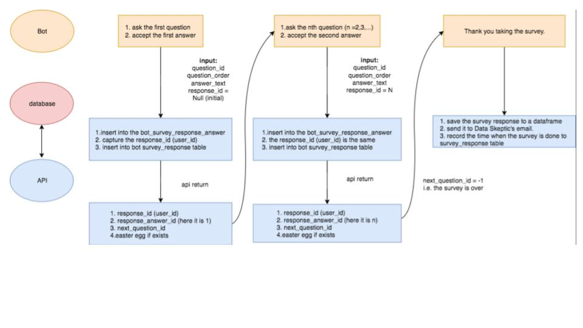

## Hello, Data Skeptic Chatbot

### The pitch for chatbots
More and more businesses are using chatbots for customer support to provide customer service, offer product recommendations and engage with customers through targeted marketing campaigns. A well-designed messenger app can make it easier for customers to find the custom information they need, instead of spending a lot of time searching through a company or organization’s website. For businesses, a chatbot could ease the load of customer support agents and help resolve service-related issues faster. 

### What can Data Skeptic’s chatbot do?
Recently, Data Skeptic decided to launch a chatbot to learn more about their audience and to provide more support. In the past 3 months, under Kyle Polich’s guidance, I built a chatbot with eight features. It can administer a survey in a messenger chat format, recommend episodes to listeners, send out reminders to listen to Data Skeptic on iTunes, Spotify, Stitcher, or at dataskeptic.com, show the profiles of Data Skeptic’s hosts, solve shopping issues at Data Skeptic and so on.

This article will focus on the introduction to the survey and episode recommendation dialogs.

### The architecture of the chatbot
There are many easy-to-use bot building frameworks that have been developed by companies, such as IBM Watson, Microsoft Bot Framework, LUIS, Wit.ai, Api.ai, Chatfuel. For this project, I adopted the Bot Framework (developed by Microsoft), which has a pre-built custom language understanding mode and it does a good job in interpreting time. The desktop application Bot Framework Emulator allowed me to test and debug the chatbot locally before launching the final version of the chatbot on the Data Skeptic website. 

In traditional chatbots, keywords matching is a common method, which can sometimes make the interactions between people and machines difficult. For this chatbot, my aspire to make an artificial intelligence chatbot that can converse naturally as much as possible. Machine learning algorithms and natural language processing make this possible. 

To embed machine learning models into the chatbot, I used Flask to build an api so that the bot can “communicate” with the machine learning models via the API. When necessary, tables in our database are created to store useful information. The chatbot can also retrieve information from tables through the API. The architecture is shown in the figure above.

Our chatbot is organized into "Dialogs".  Each is intended to handle one very specific task through chat.  Dialogs can launch other Dialogs when they determine they should take over the conversation.  Dialogs have a distinct beginning and ending.

Next, I am going to give an introduction to the following two Dialogs: survey and episode recommendation.

###Survey dialog
Since 2014,  Data Skeptic has attracted a lot of listeners. It would be interesting and meaningful to know its listeners better, like their demographics, academic backgrounds,  where and when they listen to the Data Skeptic podcasts, their feedbacks and so on. So for me, it was exciting to design a survey for the listeners. 

A general challenge in administering traditional surveys is the low response rate. A conversational survey with a chatbot could make the experience more pleasant through personalized questions, thereby increase the respondent’s response rate. The benefit is not limited to that: chatbot outperforms traditional survey form in collecting metadata, for example, when and where the surveys are taken;  respondents have more flexibility in the way they chat, that is there is no restriction to the forms of their answers. Another fantastic point I have to mention is that Data Skeptic’s chatbot can reward respondents with Easter eggs. For those who are unfamiliar with the term, an Easter egg is an intentional inside joke, hidden message, or feature waiting to be discovered. For example, if a respondent tells the bot he or she comes from Chicago, the chatbot will tell him or her that Kyle, the host, used to live there.  

Sounds fantastic? Some of you may want to design a survey like this for your own business too. Here, I will sketch the key procedures and techniques for building your own chatbot survey.

The survey is designed to have about 20 questions-- all of which are stored in a table in a database. Some questions are expected to be answered by all respondents, while some are not. Each subsequent question is dependent on the respondents’ replies to previous questions. For example, respondents will be asked “Does any episode in your recent memory stand out as being a favorite?”, if their response is yes, then the chat will go further by asking "Which one? What did you like the most? Be specific.” However, if the respondent doesn’t provide a favorite episode, then the chatbot will ask a different question. For example, it may ask "Do you listen to every episode?".  

To figure out what the next question should be based on the user’s response, we designed a logic table in our database. We also added in some Easter eggs into the database, which are rewarded when a response matches the predefined keywords.

As with traditional surveys, respondents’ answers are important. In this project, they are saved as well in our database for later analysis.  However, as opposed to traditional surveys, the chatbot has to identify whether two users are identical. For instance, someone taking a survey could get interrupted or give up before completing the questions. When he or she comes back to continue taking the survey, it would be annoying to answer the same questions again. To overcome this, the chatbot should build a profile for every user to store their data, so it is clear whether the survey is done, and if not, the file can be located. Once a survey is complete, an email containing a table with all questions and responses will be sent to Data Skeptic’s email. The process is described below in the figure below.

### Episode Recommendation dialog
The Data Skeptic podcast has released more than 180 episodes either on interviews with academics and practitioners or short 10–15 minute primer on topics like data science, statistics, machine learning, artificial intelligence and so on.  Since it is not totally ordered by topics, it is not an easy task for listeners to search for what they want among nearly 200 episodes. The good news is that a recommendation system is embedded into the chatbot so that listeners can tell the bot what topic they want to listen to, then the chatbot can give listeners recommendations according to their request. If listeners are too busy to listen to the recommended episodes now, the chatbot can help to set up a notification to remind them to listen to the podcasts at the time they want. 

You may be wondering how the recommendation system works. The idea behind the recommendation algorithm is very intuitive. For each episode, there is a title and description, which act as high-level summary of that particular show. When a listener tells the chatbot what topics he or she is interested in, the listener's request is compared with all the episode titles and descriptions, and the most similar ones will be recommended. But several questions arise: How does it compare two pieces of texts? And how does it measure the similarity between an episode and a listener’s request? Our approach relies heavily on Word2vec.

Word2vec was created by a team of researchers led by Tomas Mikolov at Google, and many natural language processing applications have adopted it. Word2vec turns text into numerical representations for easier manipulation.

To convert each episode’s descriptions and title into numerical features, I trained a Word2vec model using the posts on Stack Overflow(SO) related to statistics. This ensures SO and episodes share the vocabulary to a large extension. After running  several tests, Kyle and I decided to make the dimension of the word vectors to be 200 in our experiment. In addition to unigrams, we trained bigrams to obtain their numerical representations. Finally, there were 220,017 unigrams and bigrams. 

Since the word2vec model can capture certain semantic relationships, algebraic operations of word vectors are meaningful; hence, weighted average of all the word vectors can be used to represent descriptions of episodes. Here, the weighting factor is tf-idf (term frequency–inverse document frequency), and the listeners’ requests can be handled in the same way. Therefore, regardless of listeners’ requests, the descriptions of all episodes are represented as vectors. 

Accordingly, we used cosine similarity to measure the similarity between a user’s request and an episode description. In the experiment, we found that when a user’s request is long, this method works well. However, when the listeners’ requests are short, the recommendation is not so ideal. In this case, we found that every word is important. Following this observation, we then adopted a different method, redefining the similarity between a request and an episode as:

$cos(r,e) = \Sigma_{i=1}^N \text{argmax}_l \big(cos(w_i^r, w_l^e)\big) \cdot tfidf(w_i^r)$

where $cos(r, e)$ is the cosine similarity of user’s request $r$ and episode’s description $e$, $w^r_i$ is the $i$th word in user’s request, $w^e_l$ is the $l$th word in episode’s description. Basically, this method tries to find the words in the episode descriptions that are most similar to the words in a short request. It then uses a weighted average of the most similar words to measure the similarity between the request and an episode. 

A special case would be if all the words in the request also happened to appear in an episode’s description. In this case, the similarity $cos(r,e)$ would be 1. If there are more than one instance of such episode, then the title of those episodes will be considered.

After the chatbot is launched, the requests and recommendations will be recorded and be useful as a training dataset for future improvements.

### Conclusion
There are also other interesting dialogs in the chatbot worth exploration. Feel free to chat with Data Skeptic’s bot and let us know your experience. Have fun! 

