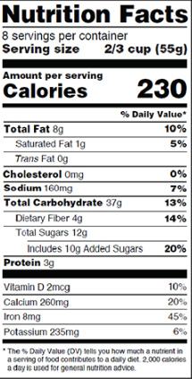
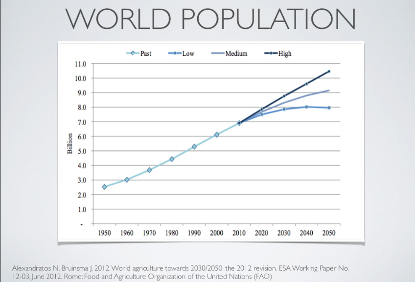

## Difficulties Finding Scientifically Based Nutritional Data

When it comes to feeding your family and taking care of your health, you want to have the most accurate nutrition information at your disposal. Unfortunately, with the rise of social media and numerous "expert" blogs, finding trustworthy data is difficult.

Although nutrition labels are more accurate now than in the past, it's legal for them to have [up to a 20 percent margin of error](http://nutritionovereasy.com/2011/04/can-you-trust-the-nutrition-facts/). What reliable sources does that leave the average consumer concerned about their health?

Companies are building relationships with consumers, while the public can demand answers regarding food production.  Social media does have its virtues, resulting in food companies, manufacturers and food retailers maintaining transparent business practices.  Thanks in part to this transparency, the food industry is incorporating new analytical processes with the goal of sharing scientifically based nutritional data with the public and sustaining agriculture.

### Understanding Nutrition Labels

Nutrition labels give consumers a peek into a packaged food's calories, serving size and micronutrient values. The serving size and calorie level take precedence and are located at the top of the label. The Nutrition Labeling and Education Act of 1990 (NLEA) sets the [requirements for the list of micronutrients](https://www.scientificamerican.com/article/how-do-food-manufacturers/) that are to appear on a package.

Calories are calculated by combining the major nutrients of protein, carbohydrates, fat and alcohol. This system is called the Atwater system, and it assigns caloric values to these micronutrients: protein at 4 Kcal/g, carbohydrates at 4 Kcal/g, fat at 9 Kcal/g and alcohol at 7 Kcal/g.

Even with these caloric values in place, if you don't follow the serving size recommendations, then you’ll consume too many calories and micronutrients.

The [nutrients section of the nutrition label](http://www.fda.gov/Food/IngredientsPackagingLabeling/LabelingNutrition/ucm274593.htm) lists the total fat, including saturated fat and trans fat, as well as the cholesterol and sodium values in the serving. These are nutrients that you need to keep at a minimum in your diet to maintain a healthy lifestyle. Eating too much of them increases your risk for heart disease, cancer and high blood pressure.

Food companies and manufacturers are required to list the fiber content, vitamins A and C, calcium and iron values on the label. Looking for them on the nutrition label helps you [make informed decisions](http://www.eatright.org/resource/food/nutrition/nutrition-facts-and-food-labels/the-basics-of-the-nutrition-facts-panel) when you need to increase a specific nutrient in your diet. The Daily Value (DV) percentages are based on a 2,000 calorie per day diet.

If the food has a 10 percent DV of fat, then it provides you with roughly 10 percent of the total fat your diet requires for the day. If you eat more or less than 2,000 calories each day, you'll need to adjust accordingly.

Some manufacturers add other micronutrients to the label, but they're not required to unless they specifically claim that the micronutrient can help aid a condition. All foods require an ingredient list if they contain more than one ingredient. Companies must order the ingredients list by weight. For example, natural peanut butter may only contain peanuts and salt. If peanuts are the first ingredient on the list, then the jar contains more peanuts than salt.

To help you [locate reliable calorie and nutrient information](https://www.programmableweb.com/category/food/apis?category=20048) for various foods, try using nutritional data websites and apps from reputable sources, such as an API database for food and nutrition.

### Consumer Perception of Food Science

In recent years, the consumer perception regarding transparency in the food industry has improved with the addition of government and corporations providing customers with valuable content to help them make healthier decisions.  As an example, the United States Department of Agriculture hosts a [USDA Food Composition Database](https://ndb.nal.usda.gov/ndb/) to assist consumers with learning more about food production.

Consumers can [access valuable information on healthy eating](https://www.nutrition.gov/about-us), weight management, nutrition and health issues, grocery shopping, cooking and meal planning through the Nutrition.gov website. Another service that [works with families to teach them](https://www.fns.usda.gov/wic/frequently-asked-questions-about-wic) about proper nutrition is the Women, Infants and Children (WIC) program. In the United States, as many as eight million low-income individuals receive benefits from WIC.

### Using Big Data to Increase Labeling Accuracy

Multiple industries collect and analyze big data to [assist with technological advancements](https://www.wired.com/2015/04/dan-zigmond/). In the food industry, this leads to increasing labeling accuracy. Hampton Creek, a new food manufacturing company, states that big data has helped their scientists analyze more than 4,000 plant proteins and create a "chicken egg" out of Canadian yellow pea and an American variety of sorghum.

Big data allows Hampton Creek to shave off years of research time to create new foods from plant species. Although there are around 18 billion proteins, the analyzed data allows the researchers to focus on combinations that are more likely to work.

### Other Opportunities for Big Data

Researchers expect the world's population to continue to grow, which translates into a [demand for more food](http://www.slideshare.net/ErikAndrejko/deep-learninginagriculture?qid=4e0bf265-9e84-45b2-91a2-7f795f28adf5&amp;v=&amp;b=&amp;from_search=6) through advanced agriculture and food science. In order to keep up with the demand, the crop yield must increase at least 60 percent by the year 2050. This is theoretically possible with smart agriculture combined with big data analytics.

Norman Borlaug, known for the Green Revolution, believed the world could feed a population of 10 billion people on a sustainable basis with its technology. By combining the breeding and fertilization of the Green Revolution with biotech and data science, the Green Data Revolution may propel sustainable agriculture to another level.

This method does have its challenges, including:

* Spatio-temporal data

* Sparse, missing or noisy data

* Latent features

* Multi-task learning

* Issues in dimensionality

Farmers can [use big data to make improvements](https://nifa.usda.gov/resource/food-and-agriculture-data-science`) to the genetics, environment, practices, soil processes, nutrient processes and crop processes to increase their yield. Open access to data is critical for nutritional security. This includes the research, analysis and open publication of data.

In 2014, the National Institute of Food and Agriculture (NIFA) used one farmer's yield to show the possible improvement of agricultural yields with the help of open access data. At the time, the National Corn Yield Average was 171 bushels. However, Georgia farmer Randy Dowdy's crop yield was 503 bushels. Dowdy accomplished this using precision farming devices and smart farming techniques like sensors, irrigation and fertilizers and big data analytics from Monsanto and Climate Corp.

As opportunities for big data continue to emerge, the difficulties of finding scientifically based nutritional data may decrease. Health-conscious consumers and farmers need to take advantage of the open access data and transparency provided by manufacturers and food companies.
