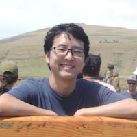

## Doctor AI

Links to include:

https://arxiv.org/pdf/1511.05942.pdf

https://github.com/mp2893/doctorai

http://mucmd.org/

http://mp2893.com/docs/jamia2016.pdf

http://mp2893.com/

Other papers from Edward mentioned in the show:

https://papers.nips.cc/paper/6321-retain-an-interpretable-predictive-model-for-healthcare-using-reverse-time-attention-mechanism

https://arxiv.org/abs/1611.07012

Remove rasberry pi reference?

	

		
		 
		
<i>Edward Choi</i>

	

	

		Edward Choi received his M.S degree in Computer Science and Engineering from the Korea Advanced Institute of Science and Technology in 2009 and his B.S. degree in Computer Science and Engineering from Seoul National University in 2007. He is currently pursuing a PhD in Computer Science at Georgia Tech, under the supervision of Professor Jimeng Sun. Edward's main research interests include predictive modeling, temporal modeling, and healthcare analytics, specifically using representation learning and interpretable deep learning for predictive healthcare. Over the past years, he has held research internships at Sutter Health, DeepMind, and more recently, Google Research.  When he's not in the lab, Edward is a dilettante pianist, a low-budget traveler, a self-approved philosopher, and most of all, a gamer at heart.
	

