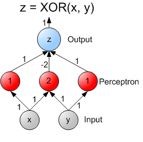

## Feed Forward Neural Networks

In a feed forward neural network, neurons cannot form a cycle.  In this episode, we explore how such a network would be able to represent three common logical opperators: OR, AND, and XOR.  The XOR opperation is the interesting case.

Below are the truth tables that describe each of these functions.

### AND Truth Table

|Input 1|Input 2||Output|
|:-----:|:-----:||:----:|
|0|0|0|
|0|1|0|
|1|0|0|
|1|1|1|

### OR Truth Table

|Input 1|Input 2||Output|
|:-----:|:-----:||:----:|
|0|0|0|
|0|1|1|
|1|0|1|
|1|1|1|

### XOR Truth Table

|Input 1|Input 2||Output|
|:-----:|:-----:||:----:|
|0|0|0|
|0|1|1|
|1|0|1|
|1|1|0|

The AND and OR functions should seem very intuitive.  Exclusive or (XOR) if true if and only if exactly single input is 1.  Could a neural network learn these mathematical functions?

Let's consider the perceptron described below.  First we see the visual representation, then the Activation function $A$, followed by the formula for calculating the output.

$A(x) = \left\{ \begin{array}{ll} 1 & \quad x \geq 0 \\ -1 & \quad x < 0 \end{array} \right$

$Output = A(w_0 \cdot Bias + w_1 \cdot Input1 + w_2 \cdot Input2)$

Can this perceptron learn the AND function?

Sure.  Let $w_0 = -0.6$ and $w_1 = w_2 = 0.5$

What about OR?

Yup.  Let $w_0 = 0$ and $w_1 = w_2 = 0.5$

An infinite number of possible solutions exist, I just picked values that hopefully seem intuitive.  This is also a good example of why the bias term is important.  Without it, the AND function could not be represented.

How about XOR?

No.  It is not possible to represent XOR with a single layer.  It requires two layers.  The image below shows how it could be done with two laters.

In the above example, the weights computed for the middle hidden node capture the essence of why this works.  This node activates when recieving two positive inputs, thus contributing a heavy penalty to be summed by the output node.  If a single input is 1, this node will not activate.

Universal approximation theorem tells us that any continuous function can be tightly approximated using a neural network with only a single hidden layer and a finite number of neurons.  With this in mind, a feed forward neural network should be adaquet for any applications.  However, in practice, other network architectures and the allowance of more hidden layers are empirically motivated.

Other types neural networks have less strict structal definitions.  The various ways one might relax this constraint generate other classes of neural networks that often have interesting properties.  We'll get into some of these in future mini-episodes.

