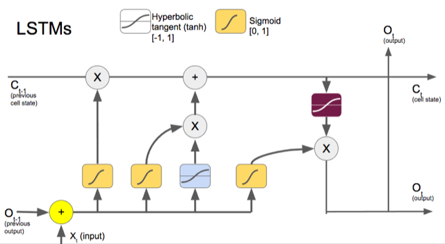
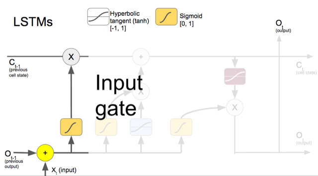
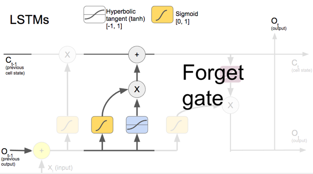
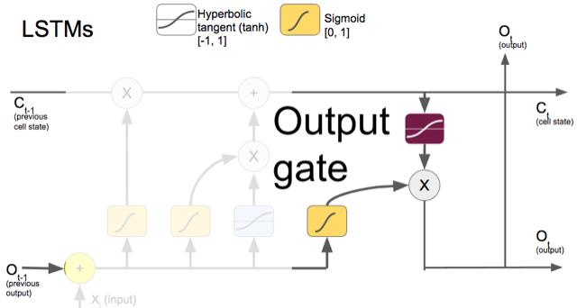

## Long Short Term Memory

A Long Short Term Memory (LSTM) is a neural unit, often used in Recurrent Neural Network (RNN) which attempts to provide the network the capacity to store information for longer periods of time. A LSTM unit remembers values for either long or short time periods. The key to this ability is that it uses no activation function within its recurrent components. Thus, the stored value is not iteratively modified and the gradient does not tend to vanish when trained with backpropagation through time.

### Typical LSTM

### Input Gate
Based on the input, this section of the network learns the conditions under which to store something in the cell state.

### Forget Gate
This section of the neural unit decides when to replace what's in the cell state with something else.

### Output Gate
Depending on the input and cell state, this portion decides what information to propagate forward.

