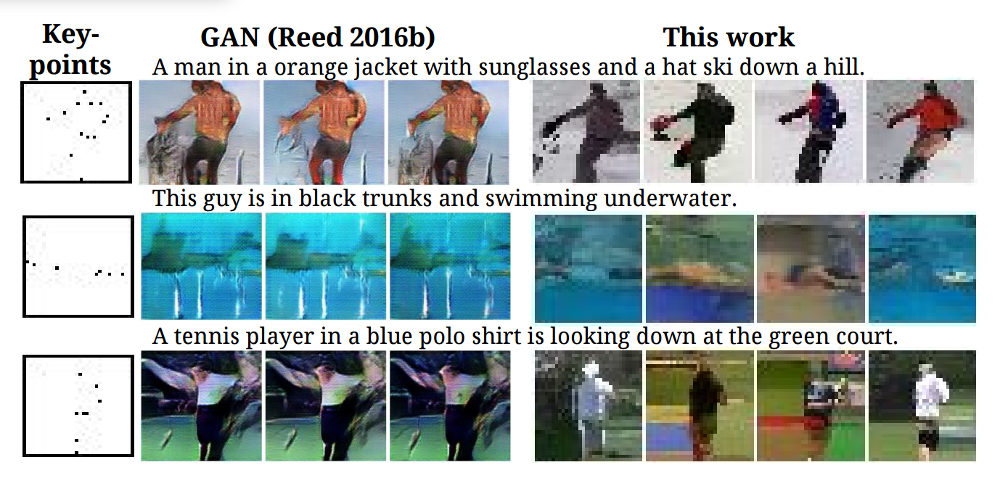
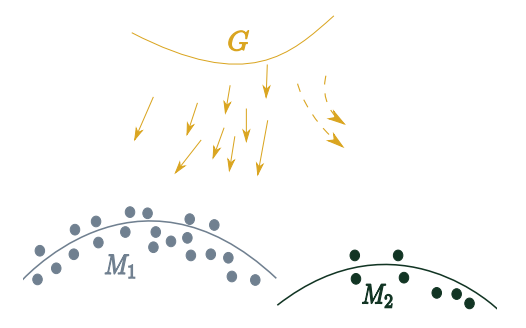
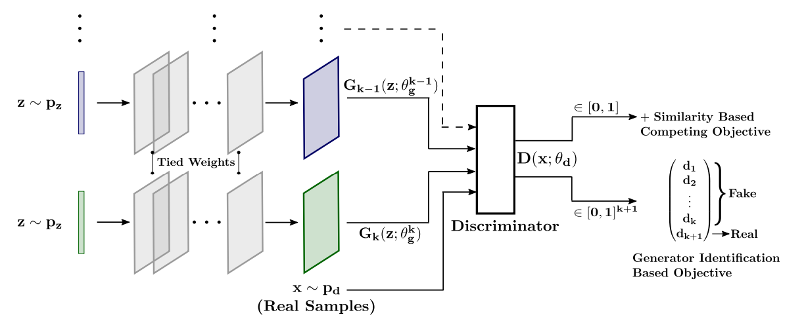
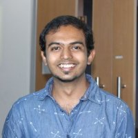

## Mutli-Agent Diverse Generative Adversarial Networks

In this episode, Arnab Ghosh and Viveka Kulharia from Oxford University join Kyle in a lively discussion on one of the major pitfalls in generative adversarial networks-- mode collapse. Arnab and Viveka share a solution to tackle this problem, which they recently published [here](https://arxiv.org/pdf/1704.02906.pdf).

Recall that a generative model is essentially a high dimensional probability distribution, in which the parameters are learned from the training data. The distribution may describe an image, a video, a time-series, text, or some other complex object. Once the model learns the distribution by drawing samples from the distribution, the model can be used to generate synthetic instances of the object

Generative models can learn to create data that is similar to data that we give them. For example, a generative model of an image, say of a face, can be used to generate synthetic images of faces. 

However, training models to create such high-dimensional representations is not easy since the structure of the data space is largely unknown. One promising solution is to use Generative Adversarial Networks (GANs), a framework proposed in 2014 by Ian Goodfellow and colleagues at the University of Montreal. Through an ingenious combination of computational graphs and game theory, Goodfellow et al. showed that, given enough modeling power, two neural network models competing against each other would be able to train simultaneously through plain old backpropagation. 

More specifically, the objective function of GANs is formulated as a minimax game, where the generator learns to produce increasingly realistic samples, and the discriminator learns to get better at distinguishing generated (fake) data from real data. The competition is meant to drive the generated samples to be indistinguishable from real data. So far GANs have been primarily applied to modeling natural images, and they are known to produce sharp and plausible images. 

###The problem of mode collapse

But despite the success of GANs in imaging, one of its major drawbacks is the problem of ‘mode collapse,’ where the generator learns to produce samples with extremely low variety. To illustrate, consider the figure below of images generated by the Generative Adversarial What-Where Network:

(Reed, S., et al. Generating interpretable images with controllable structure. Technical report, 2016)

Given the set of key points, the generator is mapping them to the same image. As a result, the images generated on the left side look very similar in the left side i.e.; there is low diversity among the pictures. The pictures on the right, however, show high diversity. Hence, there is mode collapse for the images on the left but not in the images on the right. 

The problem of mode collapse can be visualized as: 

In the image above, the gradients are biased towards the mode of drawing from a higher number of samples to form the real training data. In other words, the generator is modeling the distribution to that only covers a single mode in data distribution, which can occur when the generator is optimized while keeping the discriminator constant for many iterations.

Most interesting real-world data distributions are highly complex and multimodal.  Since images come from a multimodal distribution, you’d like your generator to show good variance and capture many of these modes. However, in the game theory GAN setting, your generator might stick to producing very few modes that fool the discriminator. In such a scenario the generator will exhibit little diversity amongst generated samples, which limits the usefulness of the trained GAN. 

###Addressing mode collapse with MAD-GAN

Two approaches have been proposed to address mode collapse: (1) improve the learning aspect of GANs; and (2) enforce GANs to capture different modes.

Inspired by the multi-agent algorithm and coupled GAN, Khosh and Kulharia took the second approach, proposing the use of multiple generators to generate different samples that would also capture the true data distribution.  Their approach, called the Multi-Agent GAN (MAD-GAN) architecture,  is shown below:

In this case, the objective of each generator in MAD-GAN is to maximize the mistakes of the common discriminator, similar to the original GANs. The majority of parameters are shared among all the generators to enable different generators to exchange information with each other. One reason behind parameter-sharing is that for a particular type of dataset, initial layers capture high-frequency structures that are almost identical. Therefore, sharing these parameters would reduce redundant computations by different generators. 

To encourage diversity in the generated samples that also capture the high probability modes of the true data distribution, Khosh and Kulharia propose two different extensions for each generator. The first extension involves tweaking the generator's objective function with a diversity enforcing term that would assess similarities between the different samples generated by different generators. The second extension comprises modifying the discriminator objective function. In this case, along with distinguishing between real and the fake samples, the discriminator would correctly predict the generator that produced the given fake sample. Intuitively, to succeed in this task, the discriminator would have to learn to push generations corresponding to different generators towards different identifiable modes.

   

	

		
		 
		
<i>Arnab Ghosh</i>

	

	

		Arnab Ghosh graduated with a Bachelor of Technology in Computer Science from the Indian Institute of Technology, Kanpur in 2016. He is currently a DPhil (PhD) student working under the supervision of  Professor Philip Torr at the University of Oxford, focusing on the mathematical theory of computer vision and artificial intelligence. His primary interests lie in artificial intelligence with a focus on learning applications for computer vision and natural language processing. Before joining Oxford, Arnab worked as a research intern at the Toyota Technological Institute in Chicago and at Adobe Research in Bangalore.
	

	

		
		 
		
<i>Viveka Kulharia</i>

	

	

		Viveka Kulharia graduated with a Bachelor of Technology in Computer Science and Engineering from the Indian Institute of Technology, Kanpur in 2016. During his undergraduate studies, Viveka held a research internship in the Machine Learning and Statistics Group at Xerox Research Centre India. He then worked as a Research Fellow for Microsoft Research India, working on Cloud Services Modeling and improving recommendation systems for Office applications. Viveka is now a DPhil (PhD) student in the Torr Vision Group at the University of Oxford working under the supervision of Professor Philip Torr. His research interests lie in the field of machine learning, deep learning, and Bayesian inference.
	

