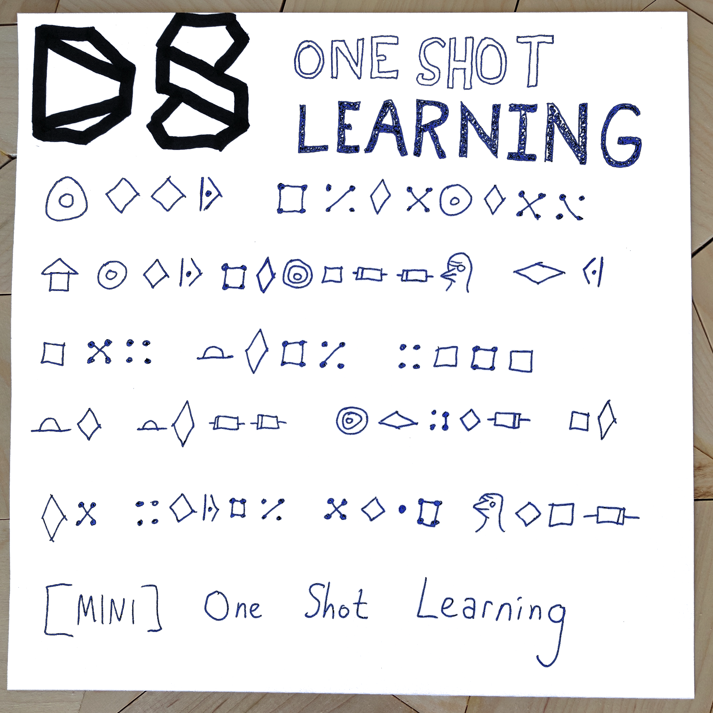

## One Shot Learning

One Shot Learning is the class of machine learning procedures that focuses learning something from a small number of examples.  This is in contrast to "traditional" machine learning which typically requires a very large training set to build a reasonable model.

In this episode, Kyle presents a coded message to Linhda who is able to recognize that many of these new symbols created are likely to be the same symbol, despite having extremely few examples of each.  Why can the human brain recognize a new symbol with relative ease while most machine learning algorithms require large training data?  We discuss some of the reasons why and approaches to One Shot Learning.

The [Omniglot](https://www.omniglot.com/) dataset is a great use case for one shot learning which is used in many papers on the subject.

There are several approaches to this technique including [Neural Turing Machines](https://arxiv.org/abs/1410.5401), [Memory-Augmented Neural Networks](https://arxiv.org/abs/1605.06065), and [Active One Shot Learning](https://cs.stanford.edu/~woodward/papers/active_one_shot_learning_2016.pdf).

