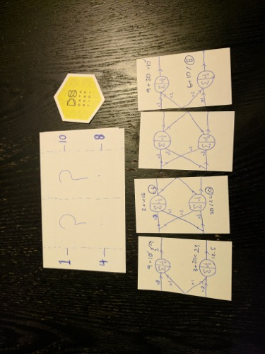
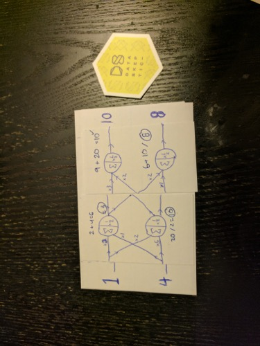

## Primer on Deep Learning

In this episode, we talk about a high level description of deep learning.  Kyle presents a simple game (pictured below), which is more of a puzzle really, to try and give Linhda the basic concept.

This introductory episode tries to describe the structure of neural networks and the very basics of the mathematics that make them work.  Future episodes will go into more detail and cover specific techniques like convolutional neural networks, recurrent neural networks, long short term memory, autoencoders, and many other topics.

Have a specific topic you'd be interested in hearing us talk about related to Deep Learning?  Join our slack channel and let us know! (To join the Slack channel, go to Home, click "Contact Us" and fill out the easy form)

