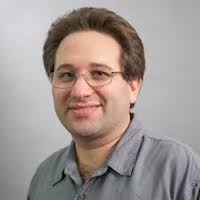

## Quantum Computing

In this episode Scott Aaronson, a professor at the University of Texas at Austin, explains what a quantum computer is, potential applications, the types of problems they are good at solving and much more. Kyle and Scott have a lively discussion about the capabilities and limits of quantum computers, and computational complexity.

What is a quantum computer and how is it different from your usual understanding of a computer? And what does not as a computer? Scott elucidates the potential and the limits of quantum computing, giving an overview of the state of research. He covers not only what we could expect from quantum computers in the future, but also what we probably shouldn't.  

A quantum computer is a computer that exploits the amplitude associated with the different classical states. Scott and Kyle also discuss the importance of negative, and complex, probability amplitudes in understanding quantum effects and quantum computing. 

So when can I expect a working quantum computer on my desk? And what can we see from a “useful” quantum computer? One use that Scott mentions is the use of a quantum computer to break public key cryptography. But whether that a useful application for humanity is debatable, according to Scott. 

Finally, today's episode relates back to our current theme of discussion: computational complexity. Scott talks about connection between classical complexity theory and quantum computing problems, and from there, quantum machine learning algorithms. Tune in to hear more.

### Links to the sources referenced during the show

[https://www.scottaaronson.com/blog/](https://www.scottaaronson.com/blog/)

[https://complexityzoo.uwaterloo.ca/Complexity_Zoo](https://complexityzoo.uwaterloo.ca/Complexity_Zoo)

[https://www.amazon.com/Quantum-Computing-since-Democritus-Aaronson/dp/0521199565](https://www.amazon.com/Quantum-Computing-since-Democritus-Aaronson/dp/0521199565)

[https://www.scottaaronson.com/papers/qml.pdf](https://www.scottaaronson.com/papers/qml.pdf)

---

        

                
                 
                
<i>Scott Aaronson</i>

        

        

Scott Aaronson is the David J. Bruton Centennial Professor of Computer Science at The University of Texas at Austin and director of its Quantum Information Center. Previously, he spent nine years as a professor in the Electrical Engineering and Computer Science department at MIT.  Scott's primary area of research is quantum computing and computational complexity theory more generally. He holds a bachelor's degree from Cornell University, a PhD in computer science from University of California, Berkeley, and did postdoctoral fellowships at the Institute for Advanced Study as well as the University of Waterloo.
        

