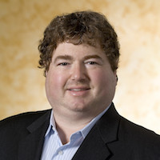

## Recommender Systems (live from Farcon)

Recommender systems play an increasingly important role in providing personalized content to online users. In this episode, host Kyle Polich joins Dr. Joseph Konstan, best known for his work in collaborative filtering recommenders, for a live recording at FARCON 2017 in Minneapolis, MN.

Recommender systems depend on the ability to gather information on peoples’ opinions on content. The earliest recommender systems (which were not web-based back then) go back to collaborative filtering (CF), which is the process of filtering or evaluating items through the opinions of other people. Basically, CF technology takes opinions of people in the community and then brings them together these opinions to form recommendations for individuals. 
This idea then blossomed in the early days of the world wide web, as the web provided the interactive environment where people could be asked to rate content. The web also enabled implicit metrics, such as: how long people looked at something, what they clicked on, what they bought, etc. 

In the 90s, commercial interest further fueled the evolution of recommender systems, and systems started broadening. Other people’s opinions and content of recommender systems started to differ, but all of them had one thing in common: they all   had recommender systems that helped with narrowing down choices by either giving a score for each one, or a list.  

Whether there is a best recommender system out there is hard to asses. Dr. Konstan believes that it all depends on which system would be the best application for a given situation. In any case, there are still unresolved issues in recommender systems. Many of the biggest unresolved issues in recommender systems relate to matching what algorithms can deliver to what users actually find helpful. Another big problem is that most recommender systems algorithms are based on similarity. The two main approaches in recommender designs (collaborative filtering and content-based recommendations) assume that the users want to see the content that’s similar to what they already like or rated highly. To address this problem, there are some hybrid approaches to recommendation system design. One approach is to address “serendipity” as an important factor in content discovery. 

However, serendipity is something that researchers in the field have been struggling with for the longest time, though it's a hot topic in recommender systems. The basic idea is that when the choices recommended are too predictable for the user, she won’t be interested anymore. So the intention is to find something the user would not expect, but still could find interesting and relevant. To measure serendity, one asks 'How unexpected are recommendations?' 

Most people would say that they’ve experienced both the delight of a good recommendation and the befuddlement of a repetitive, seemingly childish, or random suggestion. How can we better leverage machine learning to solve these problems? How can we make machines that better understand us? Where is recommendation technology headed? 

Dr. Konstan addresses these questions in his discussion about his recent paper, [Toward Better Interactions in Recommender Systems: Cycling and Serpentining Approaches for Top-N Item Lists](http://dl.acm.org/citation.cfm?id=2998211) and his research group's [MovieLens](https://github.com/nchah/movielens-recommender), a movie recommendation engine recommend movies that would have a high chance of being enjoyed by the user. Tune in to the discussion to learn more!

###Links to things mentioned during the interview:

[MovieLens](https://github.com/nchah/movielens-recommender)

[GroupLens](https://grouplens.org/about/projects/)

[Toward Better Interactions in Recommender Systems: Cycling and Serpentining Approaches for Top-N Item Lists](http://dl.acm.org/citation.cfm?id=2998211)

        

                
                 
                
<i>Joseph Konstan</i>

        

        

		Joseph A. Konstan is Distinguished McKnight Professor and Distinguished University Teaching Professor in the Department of Computer Science and Engineering at the University of Minnesota.  His research addresses a variety of human-computer interaction and ethical issues, including personalization, eliciting on-line participation, and designing computer systems to improve public health. He is probably best known for his work in collaborative filtering recommenders, such as the GroupLens project. Dr. Konstan (1993) holds a Ph.D. in Computer Science from UC Berkeley and B.A. in Computer Science (1987) from Harvard University.
        

 
