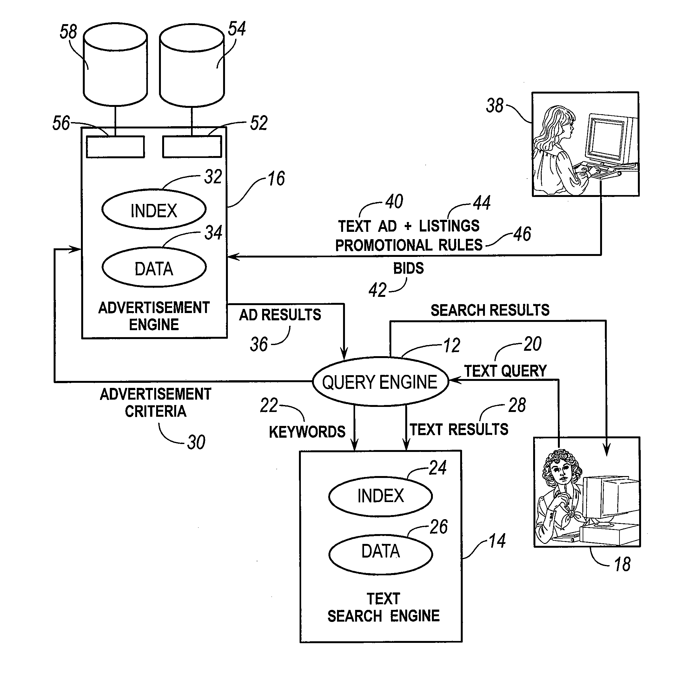
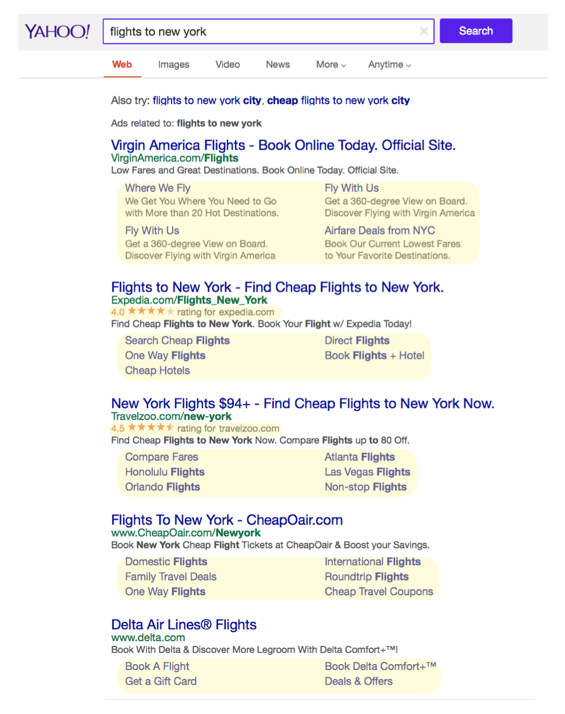
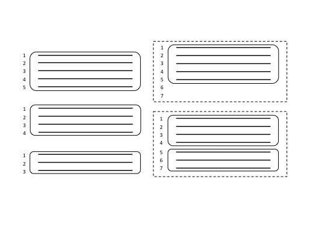

## Reinventing Sponsored Search Auctions

Internet search engines are indispensable navigational tools for interacting on the web. In addition to addressing information requests, search result pages have become a thriving advertising platform. Online advertising offers customers a more interactive way to shop and buy, while at the same time, they give sellers a more layered method of reaching the public.

In the last decade, sponsored-search advertising has become a particularly profitable market for search engines. The idea behind sponsored-search is that when a user types a query in a search engine, such as Google, Yahoo!, Microsoft, etc., an auction could be run to determine which sponsored links will get displayed and what price will be paid by an advertiser once the ad is clicked. Each advertiser bids for keywords (or phrases) and purchases sponsored links from a search engine, so that when an Internet user conducts a search using a specific term or keyword, sponsored links may be displayed on the front page in addition to search result links. When a sponsored link gets clicked, its sponsor or advertiser will pay the search engine a fee (cost-per-click) for the service of leading consumers to his website. Thereby, sponsored search auctions are not only crucial for search engines, but also for corporations and small businesses.

Below is a [patent's](http://www.google.ch/patents/US20120158490) illustration of a system for a sponsored search auction from a patent:

Various mechanisms are used in sponsored search auctions, among which the most popular are Generalized Second Price (GSP) auction and Vickrey-Clarke-Groves (VCG). The allocation of the VCG mechanism is identical to that of the GSP, but the payment is different.

The Generalized Second Price (GSP) mechanism has become the building block in sponsored search advertising. In GSP, the ads are rank-ordered by decreasing bids, and slots are assigned following this order. The minimum bid an advertiser makes to maintain that position determines the price of a slot. 

However, online advertising is becoming more complex with the expansion of allowed ad formats. For these settings, GSP is not well defined and if generalized can be ill-behaved. For example, in the case of heterogeneous ads where ads can vary in length, the search platform faces the richer problem of deciding which versions of which ads-and how many-to show. 

Suppose a search platform has a priori allocated 12 lines at the top of the search page for advertisements. Back then, ads simply displayed in three lines with a title, URL, and description. So in our 12-line example, only four available ad slots will be available, regardless of which advertisers bid. However, in the "new world" of online advertising, ads not only have the basic three lines, but they also display additional lines of search result links, star-ratings, location information, a phone number, etc. See below (Figure 1 in [Ruggiero et al., 2017](https://arxiv.org/abs/1701.05948)):

And an 'ad packing problem' emerges:

Although GSP has appealing properties when ads are simple, it does not generalize to richer ad settings, whereas a truthful mechanism such as Vickrey-Clarke-Groves (VCG) does a proper generalization. However, a straight switch from GSP to VCG incurs significant revenue loss for the search engine because they fundamentally change the way prices are computed. 

In this Data Skeptic episode, Kyle is joined by guest [Ruggiero Cavallo](http://www.eecs.harvard.edu/~cavallo/) to discuss his latest efforts to mitigate the problems presented in this new world of online advertising. Working with his collaborators, Ruggiero reconsiders the search ad allocation and pricing problems from the ground up and redesigns a search ad selling system. He discusses a mechanism that optimizes an entire page of ads globally based on efficiency-maximizing search allocation and a novel technical approach to computing prices. After introducing the rich ads problem, Ruggerio describes two key advances:

<ol>
  <li>A local search based heuristic approach to address the ad allocation problem and meet the tight runtime constraints of the sponsored search domain.</li>
  <li>A method that quickly computes prices without repeating work by coupling the algorithmic determination of a near-optimal allocation with allocation-curve construction.</li>
</ol>

   

	

		
		 
		
<i>Ruggiero Cavallo</i>

	

	

		Ruggiero Cavallo has a PhD in Computer Science from Harvard University. He was a postdoctoral researcher at the University of Pennsylvania, and then at Yahoo lab's Microeconomics and Social Systems research group. He then went on to work as an associate researcher and founding member of the Microsoft Research Lab in New York. Ruggiero is currently a Senior Research Scientist at Yahoo Labs in New York, where he works on ideas that lie at the intersection of computer science, game theory, and microeconomics, with a focus on mechanism design and its applications to multi-agent systems, electronic commerce, and artificial intelligence. In particular, he is interested in understanding social welfare, fairness, and how human self-interest and computational limitations influence decision-making processes. When Ruggiero is not working on Yahoo's Pricing and Marketplaces team, he is a musician, guitar player, and songwriter.
	

