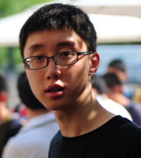

## Automated Depth Perception

This episode is an interview with [Tinghui Zhou](https://people.eecs.berkeley.edu/~tinghuiz/).  In the recent paper "[Unsupervised Learning of Depth and Ego-motion from Video](https://people.eecs.berkeley.edu/~tinghuiz/projects/SfMLearner/)", Tinghui and collaborators propose a deep learning architecture which is able to learn depth and pose information from unlabeled videos.  We discuss details of this project and it's applications.

   

	

		
		 
		
<i>Tinghui Zhou</i>

	

	

		Tinghui Zhou received his B.S. (summa cum laude) in Computer Science from the University of Minnesota, and then went on to earn his Master's degree in Robotics from Carnegie Mellon University. Tinghui is currently a fourth-year PhD student in the Berkeley AI Research (BAIR) Lab under the supervision of Professor Alexei Efros. His research areas include computer vision, machine learning, and computer graphics, with primary focus on learning-based 3D visual synthesis and understanding from 2D images.
	

