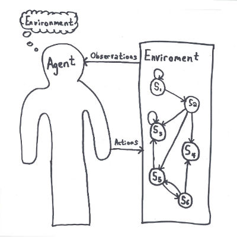

## The Agent Model of Intelligence

In artificial intelligence, the term 'agent' is used to mean an autonomous, thinking agent with the ability to interact with their environment.  An agent could be a person or a piece of software.  In either case, we can describe aspects of the agent in a standard framework.

An agent is general term for any autonomous decision maker.  This is an intentionally broad definition.  It applies to human beings, some animals, some machines, and perhaps other categories as well.  Let's start with the definition and the get into a discussion.

An agent is anything that perceives things (perhaps imperfectly) about it's environment and can then make a decision to execute some actions which will have some (perhaps unpredictable) effect on the environment.  Whether an agent's sensors are biological eyes or cameras, cochlear nerves or omni-directional condenser microphones, the framework robustly describes an agent as a mapping from historical observations to a distribution over actions.

Let's define a set $A$ that contains all the actions an agent can take.  In a video game this might be "Run Left", "Run Right", "Jump", "Attack", and "Idle".  An agent can select what action to take from this set.

Similarly, let the set $\Omega$ contain all the observations an agent can make.  A simple electronic thermostat likely contains two sensors: one for the ambient temperature, one for the position of the temperature dial.

We can now give a formal definition of an agent.  An agent is a function $f$ mapping a history of observations $\omega$ (from time 0 to time $t$) to a particular action $a$:

$f$ : $\big( \omega \in \Omega \big)^t \rightarrow \Delta a \in A$

Whatever series of observations the agent receives, out of all possible combinations, the agent should process those observations in some way and decide on an action to take.

The methodology for *how* an agent decides which action to take given their observations is outside the scope of this discussion.  Any agent can be described this way.  More sophisticated agents will maintain some internal representation of what the believe the world looks like.  As new information arrives, they can update those beliefs and select a best action in response to their beliefs about the state of the world.
