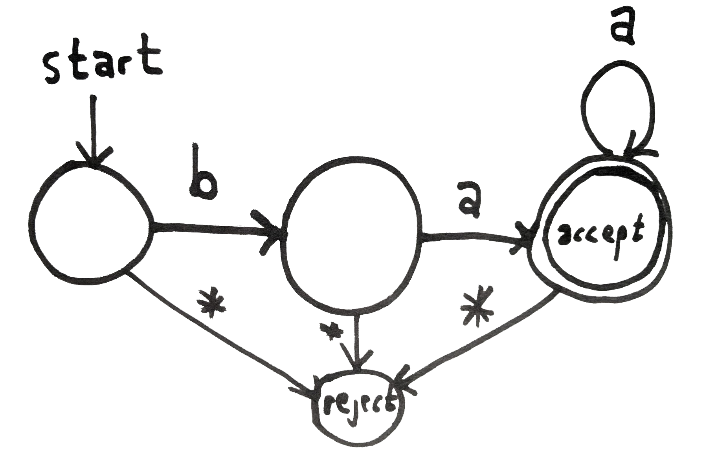

## The Theory of Formal Languages

In this episode, Kyle and Linhda discuss the theory of formal languages.  Any language can (theoretically) be a formal language.  The requirement is that the language can be rigorously described as a set of strings which are considered part of the language.  Those strings are any combination of alphabet characters in the given language.

These concepts are relevant to artificial intelligence in that we'd like to consider what sort of machine is required to be able to recognize each language.  Recognizing a language involves being able to determine whether or not a given string is a part of that language.

For example, if we consider a subset of the English language that is only lower case, then we could enumerate all the strings, which might look something like this:

```
aaaaaaaaaaaa
aaaaaaaaaaab
aaaaaaaaaaac
...
data skeptic
data skeptid
...
zzzzzzzzzzzz
```

We discuss "sheep" language, which takes the form (described here as a regular expression): `ba+`, meaning that all valid utterances start with `b` and must be followed by at least one `a`.  This trivial language requires only a trivial finite state machine with four states.  Kyle says 2 states in the episode, but it's really 4.



To follow the finite state automata pictured above, you begin in the start state.  If you observe a `b`, transition to the next state.  If you observe an `a`, transition to the final state.  In this state, you may accept the string at any time, and you remain in this state as long as you only observe `a`s.  Observe anything but the precise things described transitions you to the reject state.  The accepting state has two circles because many text use this convention to label it as an accept state.

Although somewhat abstract, this is the blueprint for the compute required to recognize sheep language.  In addition to the sheer simplicity of this machine, take notice of the fact that it requires no "memory" beyond knowing the current state.  One can mindlessly follow this graph, requesting the next letter, and then moving as the arrows specify.  One need not remember *how many* `a`s have been observed.  This is a distinguishing feature of finite state automata (FSAs).  Although limited, they are often extremely powerful tools.  Further, their simplicity makes it possible to state formal proofs about their results, and demonstrate mathematically that they correctly do the job they are supposed to do in a bug free way.  That's something which is difficult if not impossible to do for a typical software application.

Any language that can be recognized by a FSA is called a regular language.

There exist a series of proofs known as "pumping lemmas", the most famous of which states that there are languages which are not regular.  The canonical language is one which has some number of `b`s followed by precisely the same number of `a`s (i.e. `b*a*`).  Since this requires one to "remember" the number of `b`s, no FSA can do it.  Sure, you can construct an FSA that can recognize a subset of this language up to a certain length, but recognizing it completely would require an infinite number of states, and that's not allowed right there in the name.

The simplest machine capable of recognizing `a*b*` is a push down automata (PDA).  A PDA has a [stack](https://brilliant.org/wiki/stacks/) for a memory.  Clearly, that's limiting, but it's just enough to meet our needs for this other language.

I hope that it's quite obvious such a machine is hopeless for recognizing English sentences.  This is sometimes a point of confusion, because a PDA is totally capable of recognizing the general *grammar* of an English sentence.  The process of diagraming a sentence into noun phrases, verb phrases, and further nestings down to the individual parts of speech can be accomplished by a PDA.  But recognizing a true English sentence from a gibberish sentence that fits the general form is not possible with a PDA.  For that, you need a [Turing machine](https://dataskeptic.com/blog/episodes/2017/turing-machines) which is capable of computing anything which is intuitively computable.

There are other levels in the hierarchy of formal languages, but FSA < PDA < TM covers the (arguably) most important there.

