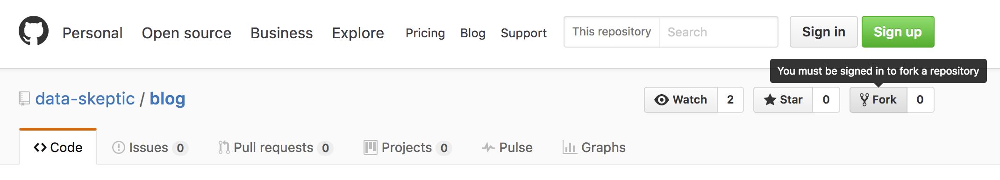
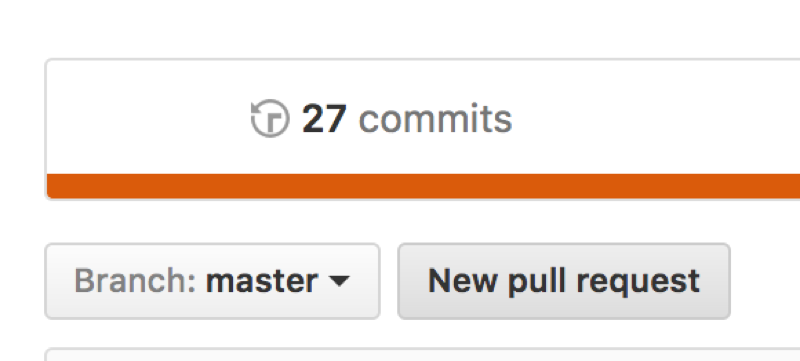
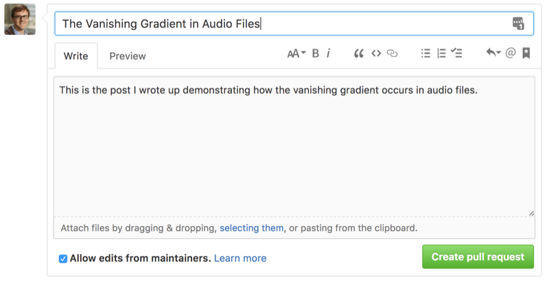

## Using Git as a CMS

When we rebuilt dataskeptic.com one of our main focuses was setting a foundation to make blogging about data science easy both internally and for guest bloggers as well.  It must be easy to publish both Jupyter notebooks and knitr's output.  Latex has to work well, and figures should be managed seamlessly.  We eventually want to enable interactive plots without headache to the writer, and other more advanced features.

We looked at powerful tools like Wordpress but found enough nit-picks with their system that it didn't work for us.  There is a cottage industry of fledgling projects doing something useful in the sketch of a pipeline we were thinking of.  But none of the available solutions were close enough to our needs to make sense for us to adopt and possible contribute.

I focused on what would make it easiest for me personally to have frictionless publication.  Once I type the last period, I should have at most 2-3 trivial steps to publish.  When I am developing an analytical blog post, it's generally a multi-day affair, so I'm committing to git.  This serves as a backup, emergency undo history, and file share between machines and feels quite natural to me anyway.  It seems like every useful thing I do in life requires a commit.

So it became clear that we should give git a shot as our content management system (CMS).  We can adopt typical branching strategies and PRs as well for merges.  And if we extend the git metaphor, then a guest blogger can submit their work by sending a pull request to [our blog's repository](https://github.com/data-skeptic/blog).  I have to admit, that initially seems slightly contrived, but we're going to give it a shot.

Below are instructions on how you can properly send us a guest blog submission via pull request.

### Submitting your Blog Post as a Pull Request

Although we will certainly review blind submissions, as in all open source, it's probably best to get in touch first and tell us what you're thinking :)

1. Fork [https://github.com/data-skeptic/blog](https://github.com/data-skeptic/blog).

2. Create a branch in your fork with a name loosely describing your topic.

3. Write your blog post.

4. Clear your memory and re-run your code.  If using Jupyter, restart the kernel.  If in R, try `rm(list = ls())`.  This step is important because the REPL nature of many coding environments might leave you in a state where your code is not reproducible.

5. Check the re-run of your code to make sure all your results work out the same.  We won't accept submissions with code that cannot run.

6. Add and commit the relevant files.

7. Create a pull request.

8. Review your commits and hit "Create pull request".

9. Write a short message in your comment describing the post.

10. Wait patiently for us to review!

### Files to commit

In many cases, your blog post will probably be a single file, however, should you need additional files attached, carefully consider what and how to add them.

If your post does analysis on some large CSV (or other file), if the size is trivially small (<1k), feel free to commit it.  For anything larger, please place that file somewhere online and programatically retrieve it in the code in your post.

If you have external images that you don't or can't embed in your submission, follow these steps:

* Create a directory called `src-my-blog-post-title/`.
* Put your images there.
* Ensure that your source files that reference them are using relative paths.
* Commit the images.

For any other special cases or issues, please reach out to kyle@dataskeptic.com to figure out a good solution.