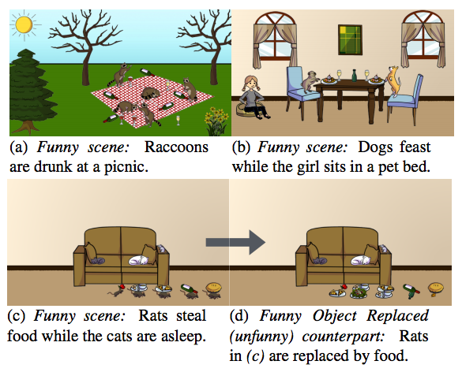

## Computational Humor

When you think about how you see and process the world, imagine how you would teach a computer to do that? This is a problem that falls under computational humor, [which many people believe lies in the AI-complete category of AI problems](https://pdfs.semanticscholar.org/1742/50f45f0cc668c0524e0e5dd594047dfb33b0.pdf), meaning that if it is solved, computers can be said to be as intelligent as humans. Computational humor also falls under [natural language understanding](http://idiom.ucsd.edu/~rlevy/papers/kao-etal-2015-cogsci-puns.pdf).

### Theories of humor

One aspect of human intelligence is the ability to process all this information and find novel ways to turn things funny. Do we even really understand what makes things funny? Throughout history, many attempts have been made to figure out what exactly makes things funny. For example, Plato and Aristotle thought humor through laughing at the misfortune of other people was all about [superiority](http://digitalcommons.bucknell.edu/cgi/viewcontent.cgi?article=2299&context=fac_journ). Then in the late 18th century, philosophers [Schopenhauer and Kant](http://www.iep.utm.edu/humor/) presented the [incongruity theory](http://scholarworks.uvm.edu/cgi/viewcontent.cgi?article=1024&context=hcoltheses), which is the idea that humor arises from the inconsistency between what people expect to happen and what actually happens. A new idea was added in the 20th century to the [literature on humor by Freud](http://medhum.med.nyu.edu/view/12852), who reasoned that jokes or witticisms enable a person to vent his aggressive or sexual feelings and anxieties in a disguised, subdued, even playful manner. In other words, the repressed energy released in this way takes the form of laughter. More recently, the author Peter McGraw and his collaborator Caleb Warren [proposed the benign violation theory](http://www.petermcgraw.org/a-brief-introduction-to-the-benign-violation-theory-of-humor/), in which humor occurs when a situation seems wrong or threatening, but simultaneously seems okay or safe. According to this theory, play fighting is funny because it involves violating someone’s physical space in a harmless way. 

### On the Quest to Understand What Makes Things Funny

While jobs are steadily becoming more automated and computers are taking over physical and cognitive tasks once deemed traditionally for humans, there’s one job that might not be automated for a very long time, if ever—that of a comedian. Identifying and generating humor is incredibly complex. For an algorithm to do this requires a deep semantic understanding, along with cultural and other contextual cues.

AI researchers have been working to create algorithms that can understand and detect various shades of wit from their human counterparts and fire back in return with their own made-up jokes. Consider the following jokes:

I like fingers like I like my notes, sticky.

I like periods like I like my verbs, irregular.

I like thrills like I like flights, cheap.

Why were these funny? And to whom are they funny? Even if none of these weren't particularly funny to you, would you still categorize it as “humor”? Chances are, you might have found one of them funny. But why? What makes things funny, and how reliant are they on specific contexts? In the jokes mentioned above, the structure was simple:  “I like my X like I like my Y, Z.” This structure is a comedy trope, where X and Y are nouns, and Z is typically an attribute that describes X and Y. The humor agent can find two words that mean the same thing, but in different situations, people might not have thought of that. Such is an example of an incongruity. But does that make it a joke? Even the line "I like periods like I like my verbs, irregular" is not inherently humorous but relies on a prior awareness of the woman's cycle. Just being able to understand the reference in this joke is not what makes it funny, though. By changing the meaning of the punchline, the joke surprises the listener and subverts expectations about how the line was going to end.

A team of [Stanford researchers sought to formalize incongruity](http://idiom.ucsd.edu/~rlevy/papers/kao-etal-2015-cogsci-puns.pdf) and test its relationship to humor in puns, using a computational model based on existing formal metrics from language understanding. To capture the relationship between the meaning of a sentence and the words that compose it, they constructed a simple probabilistic generative model:

Here, a word is generated by a specific meaning with the idea that m could be a variety of meanings. Given this, they then derive a joint probability distribution over sentence meanings and semantically relevant words: 

P(m,\overset{\rightharpoonup}f | \overset{\rightharpoonup}w ) = P(m | \vec{w})P(\vec{f} |m, \overset{\rightharpoonup}w )

They found two significant predictors of humor: ambiguity and distinctiveness, where entropy quantify ambiguity, whereas distinctiveness is about Kullback-Leibler divergence of the indicator variables f for each meaning. The model turned out to be surprisingly good at identifying degrees of funniness as well as the features of a pun that makes it amusing. However,  it still needs to be expanded towards other formats of puns, as many are framed in a dialogue.

### Limits of Natural Language Processing

[John Haugeland](https://en.wikipedia.org/wiki/John_Haugeland), a philosopher and AI researcher, pointed out that computers have difficulty producing language because they lack knowledge about the world and knowledge about the ways in which people communicate, respectively. Even though computers can process big data, the ambiguous nature of language causes problems because understanding information within particular contexts requires knowledge of what is relevant in a given situation, not statistical probability. To illustrate this distinction between data and knowledge, consider  these Google Translate's attempt to translate one human's ideas into another human's language:

When Daddy came home, the boys stopped their cowboy game. They put away their guns and ran out back to the car.
 When the police drove up, the boys called off their robbery attempt. They put away their guns and ran out back to the car.

Haugeland argued that the two sentences would be difficult for computers to translate because the translator has to choose between different expressions that explain the intended meaning. Did big data solve it? No. In fact, Google’s system continues to demonstrate Haugeland’s point.

Here’s the translation for (1) in German (the translation language Haugeland mentioned, along with French):

Wenn Papa nach Hause kam, hielten die Jungs ihre Cowboy-spiel. Sie legten ihre Waffen nieder und lief zurück zum Auto.

And here’s (1) translated back into English:

When Dad came home, heard the boys with her cowboy game. They laid down their arms and ran back to the car. 

More recently, AI researchers from Virginia Tech have developed a machine-learning algorithm that can recognize and generate humorous scenes. By utilizing Amazon's Mechanical Turk (AMT) service to create and make 6,400 funny and unfunny scenes using a clip art program, the team's algorithm can accurately predict when a scene is funny and when it is not, even though it knows nothing related to the social context of what it is seeing. First, they also asked for a one sentence description describing why each of the "funny" scene submissions was funny. Then, they asked the AMT to rate the level of funniness in each scene.

Here are some scenes from their study:

The submissions led the VT team to ask whether or not the funny object could be replaced by a similar, but unfunny counterpart in an attempt to understand the semantics of humor. To do this, they had AMT create 15,000 alternatives to the humorous scenes. The researchers found that the algorithm was proficient enough at predicting the funniness of a scene and that animate objects like people and animals tend to generate funnier scenes than inanimate objects. 

These studies still make me wonder if we know enough about what makes something funny to tell if algorithms can really understand and detect humor. An important question to ask is: what exactly is the algorithm learning to do? Humor may be a proxy for something else entirely. Finally, does computational humor add up to anything significant?
