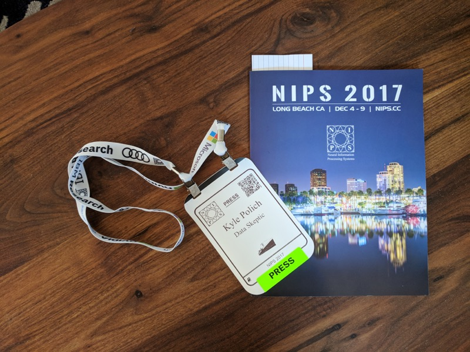
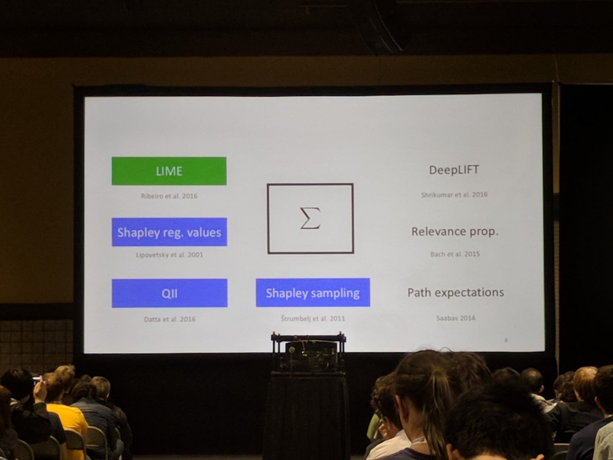

## NIPS Day 2

The Neural Information Processing Systems conference (NIPS) reached a record 7850 registered attendees this year.  679 papers were accepted out of 3590 submissions (18.9% acceptance rate).  The accepted papers where 90% academic and 10% industry submissions.

Day 1 of NIPS featured tutorials and trainings.  Day 2 kicks off talks, posters, and demos.

The first invited speaker was Brendan Frey who gave a talk titled [Reprogramming the Human Genome Using AI]](https://dataskeptic.com/blog/news/2017/reprogramming-the-human-genome-using-ai) which I blogged about independently.

## The Trouble with Bias

Kate Crawford presented a talk summarizing a field of research including her on on the topic of algorithmic fairness.  We've previously discussed [Auditing Algorithms](https://dataskeptic.com/blog/episodes/2016/auditing-algorithms) and heard insights in the last segment of of my interview with [Michael Kearns](https://dataskeptic.com/blog/episodes/2017/the-computational-complexity-of-machine-learning) who is an active researcher in this space.  

Kate's message was well tuned for the NIPS audience.  She provided a set of labels that can be used to describe the types of algorithmic bias that we as a society may want to concern ourselves with: denigration, stereotyping, recognition, under-representation, and ex-nomination.  These are fairly effective labels in that they're all rather self explanatory (except perhaps the last one, which I had to google).

She outlined the technical response to how we can combat bias in algorithms in five ways:

*Improved accuracy* - Naturally, we should never stop trying to systematically eliminate harmful bias through regularization techniques or other approaches.

*Blacklist* - When a person wants to criticism the use of algorithms, its not difficult to cherry pick extreme example cases where a (likely unintended) photo caption or auto-suggest option is deeply offensive.  A curated blacklist could be a useful if incomplete tool to alleviate some issues.

*Scrub to neutral* - When a dataset contains features which we would not want involved in making a prediction, those features can be removed.  Due to correlation, this is not always an easy thing to do or something that can be guaranteed, but its certain within the spirit of producing fair algorithms.

*Equal representation* - There have been highly publicized instances where algorithms produce output which is racist or sexist. Algorithms displaying ignorance of this sort might be doing so because they lack sufficient examples to learn about the minority cases, if their training data over-represents majority cases.

*Awareness* - Last, and perhaps most importantly, is awareness.  There is no perfect solution, criteria, or technique which can perfectly detect the types of biases that could arise in machine learning systems.  An awareness of what could go wrong is critical.

## Model interpretability

We first covered the topic of model interpretability last year in an episode called [Trusting Machine Learning Models With Lime](https://dataskeptic.com/blog/episodes/2016/trusting-machine-learning-models-with-lime).  Lime has grown in popularity since that time and inspired many further work, two of which were presented as part of the Algorithms and Optimization track at NIPS.

### Streaming Weak Submodularity: Interpreting Neural Networks on the Fly

Elenberg, Dimakis, Feldman, and Karbasi propose an efficient streaming algorithm to solve it subject to a cardinality constraint.  Let's say a deep learning model makes a prediction about an image.  If a photo shows two species of flowers, why did this model describe it only as containing "sunflowers"?

This question can be approached as a subset selection problem.  Divide the image up into small pieces.  Ask your model to re-classify the image a few more times, but blur out many of those subsets on each iteration.  With enough time, you could identify the minimum set of small pieces (minimum subset) required to effectively describe why the image got the label it got.

Unfortunately, subset selection is $NP-Hard$ as well as provably hard to approximate.  However, their work seems to present the "Streak" algorithm which can do this efficiently under some constraints.  I haven't been able to read this paper in great detail yet to provide to core insight, but their reported empirical results claim similar explanations to LIME with faster runtimes.

[Streaming Weak Submodularity: Interpreting Neural Networks on the Fly](https://arxiv.org/abs/1703.02647)

### A Unified Approach to Interpreting Model Predictions

Lundberg and Lee's presentation included a nice survey of interpretation frameworks (see below) including a few from the game theory literature that I was not familiar with (shown in blue).

Two desirable properties of any model interpretation framework are consistency and local accuracy.  With these motivating criteria, the authors present the concept of SHAP (SHapley Additive exPlanations) values.  The authors claim this perspective we can unify all the other frameworks under two parameters, and that these two parameters can be optimally tuned.  I'm very interested to explore that claim further.

Source code available at github:

[https://github.com/slundberg/shap](https://github.com/slundberg/shap)

### Communication Efficient Distributed Learning of Discrete Distributions

Diakonikolas, Grigorescu, Li, Natarajan, Onak, and Schmidt present a nice paper on efficient distributed learning.  The problem statement is as follows.  Your data set is split up amongst a cluster of machines.  You want to learn the distribution of the data, but each machine only sees a small fraction of the data.  You'd like to allow them to coordinate in a way that their shared information can be pooled in some useful way, in other words, you want to perform distributed learning.  In the worst case, all computers could send their entire slice of the data to all other computers.

There's another interesting detail.  In their protocol, the computers have a shared "blackboard" which they can all read for free.  Each computer contributes some information that summarizes the data they saw by writing it to this shared blackboard.  They want to minimize the bits the have to transmit.  The first contributor writes on an empty board.  Future contributors may freely read the board, and thus, condition what they write based on what's already there.

A known result is that if we make no assumptions about the data, then there isn't much you can do.  That's the worse case, but it can actually be done with only $O(n \hspace{2pt} \text{log} \hspace{2pt} D)$ bits of information sent - we'll call that the baseline protocol.

If you make some structural assumption (some particular feature know for your data), this feature can often be exploited to make improvements over the baseline protocol.

If the data were Gaussian distributed, then each computer could provide just the observed mean and variance, all of which could be averaged for a fine global result (thanks to the central limit theorem).  However, what if you live in the real world, where data is never really exact Gaussian?

Their work is based on k-histograms.  Since we're talking about the real world, I find most problems there have very little loss of precision when one discretized the distribution, so I see this as a very general assumption myself.

This paper establishes a nice lower bounds.  The derivation gets a bit technical and I don't have an elegant way to summarize it, so if this problem setup is an interesting one to you, I recommend checking out their excellent paper linked to below.

[http://papers.nips.cc/paper/7218-communication-efficient-distributed-learning-of-discrete-distributions.pdf](Communication Efficient Distributed Learning of Discrete Distributions)

