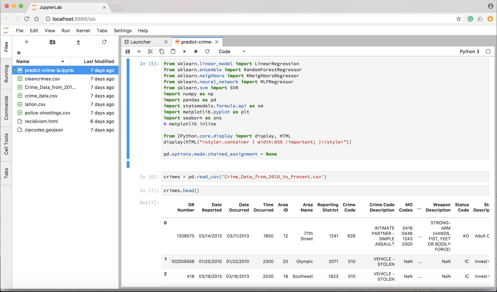

## JupyterLab

We recently adopted Jupyterlab at Data Skeptic HQ as our primary Python development procedure, superceeding plain vanilla Jupyter notebooks.  At first, we weren't going to blog about it, until we noticed this one killer feature.

Before we get to that, let's discuss this milestone release in general.

You’ve probably have heard of the debate over why one should use Python 2 over Python 3. Maybe some of you may be confused as to which one you should use — Python 2 or Python 3? Well, scientific Python projects are officially sunsetting Python 2 [by 2020](http://python3statement.org/). And the [NumPy project](https://github.com/numpy/numpy/blob/master/doc/neps/dropping-python2.7-proposal.rst) is phasing out support for Python 2. For those who write code, it is time to migrate to Python 3. Python 3 is a better written software that takes care of the bugs that were in Python 2. Also, most Linux distributions have Python 3.x already installed, and all have it available for end-users.However, there are disadvantages of using Python 3. For example, there are more third party libraries for Python 2 than for python 3, especially for machine learning algorithms. But, over time that will change as more of the packages will be written or rewritten for Python 3. 

This debate relates to the recent news from JupyterLab. Should one use Jupyter notebook or JupyterLab. As some of you may know, we do most of our analysis on Jupyter notebook, but we’ll be adopting JupyterLab too. 

So the classic Jupyter notebook as you may know is about, at this point, more than just notebooks. In addition to having notebooks, Jupyter has a text editor, an in-browser terminal, a full-blown file browser, and all of these different things are needed for doing interactive computing with data. Whether you're doing data science or scientific computing or machine learning, usually you want to run the computation where your your data is and that's often not in your laptop. So a lot of our users are starting to run Jupyter in a context, where the data is not on their laptop -- they're connected to some remote system. At that point the Jupyter notebook is the user interface not just writing that code, but to the entire system. So having the file browser with a terminal and all these other things become really important building blocks for interactive computing. 

But if you think about the RStudio workflow, the classic Jupyter notebook is not the only way of assembling and integrating these different building blocks. Traditionally, Rstudio allowed you to just edit standalone R scripts and then select blocks of R code to run them in something like a code console. It's a different workflow, and it still uses the same abstractions for interactive computing of having a place to type code, output, etc. but it's a different way of assembling those building blocks.

Jupyter merges both IDE and notebook functionalities. It’s mostly convenient when you work on multiple notebooks or project, as it allows you to concentrate all your python work under a single tab. It’s nothing that will change your life, but think of it like Jupyter notebook plus a better user interface.  We're excited about the new extension system and how people might take advantage of that to extend functionality.

Everything about our first glance at JupyterLab is positive but small changes.  This is largely because we have few complains about Jupyter Notebooks.  The first feature we fell in love with was ability to place two notebooks side by side with a terminal window underneath.  It's great, but incremental.  JupyterLab seemed like a more polished version with some notable UI/UX improvements that make the notebooks more pleasant yet not radically changed. Our first glance made this a release where, it seems, the typical end user might not fully appreciate the improvements made to the underlying architecture.  That is, until I started taking advantage of one killer feature.

My workflow used Jupyter Notebooks in two ways.  First, I have two instances of a dedicated hosted server which I log into for doing my work on an always-up Jupyter notebook (JupyterHub in one of those projects).  Second, when running things locally, I arbitrarily run `jupyter notebook` in my repository's root directory and get to work.

My local workflow often left me with a new garbage collection task when I left something running and forgot about it.  Every so often, my terminal tabs needed a scrub.  A little messy, but not that bad.  You can imagine that a habit like that means I would sometimes lose my running notebooks when I needed to restart for some reason.

If you work your machine hard and write code that can be very demanding on memory, it's not terribly uncommon to get yourself in a predicament where the only fix is a reboot.  I used to **dread** (and still do) a hard reboot since it feels like both a time sync and a time to "loose my place" on the machine.  Chrome has matured extremely well in this regard.  I never lose my tabs anymore.

However, I had "lost my place" many times in my projects that I work on locally with Jupyter Notebooks.  But thanks to the JupyterLab release, that won't happen anymore.  The application now remembers your prior settings.  When I navigate to project repository root directories and spin up `jupyter lab`, it now brings me back to where I left off.  My Kernels are, of course, reset, but my organized IDE is no longer lost.  Great improvement!

In addition, there are more features available only in JupyterLab. For example, within the JupyterLab environment, you can: access files without having to go on another page, open a raw data file like .csv file, and open a terminal, making development and software maintenance much more convenient. The documentation for JupyterLab can be found [here](https://media.readthedocs.org/pdf/jupyterlab/latest/jupyterlab.pdf). 

