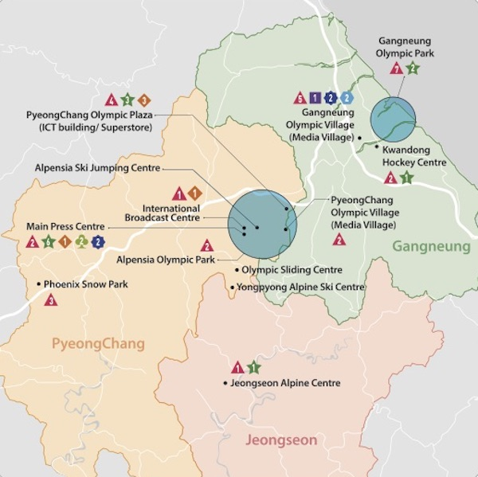

## Olympic Robots

As the world's fifth biggest exporter and 10th-largest economy, South Korea has been known for its cutting-edge technology, having already deployed robotic teachers, industrial manufacturing workers, translators and service staff. This year at the Winter Olympics, which began on last Friday evening in South Korea, a fleet of eighty-five robots were deployed across the sporting venues in PyeongChang to provide a variety of services at these events, showcasing the nation’s robotic prowess. 

According to professor Jun-ho Oh, the director of the Institute for Robotics at the Korea Advanced Institute of Science and Technology (KAIST) and head of the Olympics’ robot support team, eleven types of new and unique robots were picked to be deployed. Organizers chose to focus on showcasing robots that could deliver practical and useful services during the Olympics.

Some of the new technologies that South Korea has put together for this year’s Winter Olympics include: talking robot guides that can provide event information and recommend places for sightseeing in four languages (Korean, English, Chinese and Japanese), painting robots that can draw murals during the games, and 5-G equipped autonomous buses that can transport guests to and from the games’ twelve venues.

Below is a map of robots deployments.

Dr. Oh, who lead Team KAIST to win the [2015 DARPA Robotics Challenge](https://spectrum.ieee.org/automaton/robotics/humanoids/darpa-robotics-challenge-finals-winner) with an adaptable humanoid called DRC-HUBO, [told IEEE](https://spectrum.ieee.org/robotics/artificial-intelligence/robots-ready-to-ski-paint-and-clean-at-south-koreas-2018-winter-olympics) in an interview that he has three rules for designing eye-catching, crowd-pleasing robots that are also safe and reliable. First, he said, the robot must not make trouble. Secondly, it must do something new, even if that just means teaching an existing robot new tricks. Third, he said, the robot must be useful.

In the interview, Dr. Oh said he was most excited about “DRC-Hubo+.” He and his team at KAIST developed DRC-HUBO+ to assist with disaster recovery during the games. An upgraded version of “HUBO,” DRC-Hubo+ can autonomously navigate dangerous situations and discern items of interest. 

Robots are also participating as athletes for the first time in Olympic history. On Sunday, February 11, the country hosted the world’s first ski tournament for self-operational humanoid robots at the Welli Hilli Park ski resort in Dunnae. The “Ski Robot Challenge,” sponsored by South Korea’s Ministry of Trade, Industry and Energy and hosted by the Korea Institute for Robot Industry Advancement (KIRIA), was designed to encourage the development of design, intelligence, and control in robotic technology. In the months leading up to the games, the teams used data collected during trial runs to teach their robots how best to maneuver through gates on the course. 

Eight teams from local tech companies and universities were selected by the Korea Evaluation Institute of Industrial Technology to compete on the slopes. The robots competing in the event were required to be humanoid, bipedal, fitted with skis, standing at least 50 centimeters tall,  capable of autonomous walking, and equipped with image processing and sensors. Each roboskier’s power source had to be equipped with an independent source that uses only electricity. They also had to be free of human control, receiving no outside commands during the competition other than the start signal. 

The evaluation criteria for the Ski Robot Competitive Exhibition is based on the rules of the Giant Slalom event, a type of alpine skiing, but has been modified to some extent for the robots. A special committee on ski robots was formed to oversee the tournament evaluation mission and regulations.

