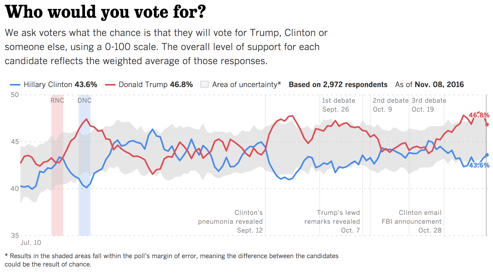
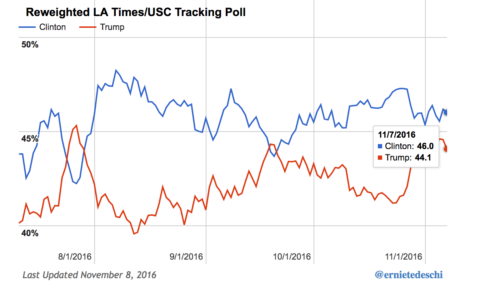
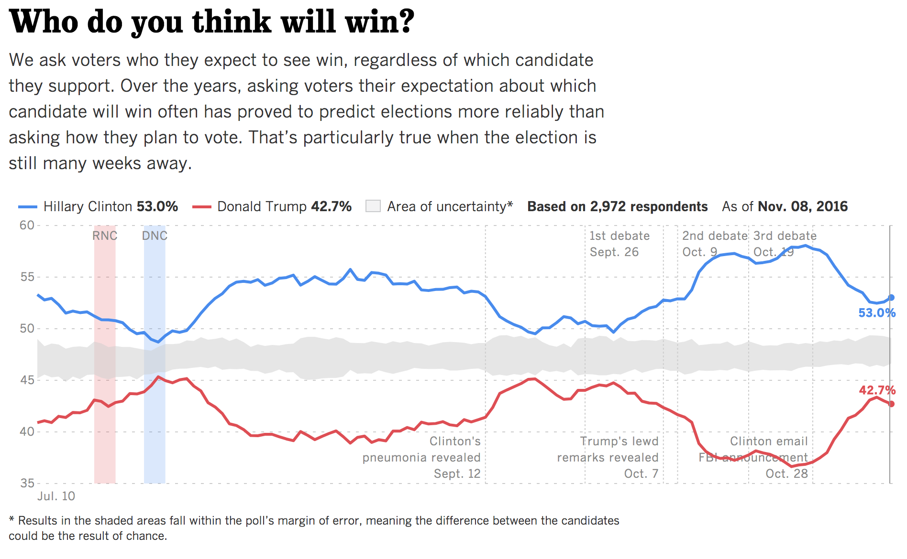

## Everything I’ve learned about the USC/L.A. Times poll

A dubious perk of working at the <em>L.A. Times</em> in 2016 was that some friends started associating the USC/L.A. Times poll with me.

As November approached, “Hey, what’s up with your poll?” became the new “How’s it going?” The poll, which was administered by USC—not by me or my Times colleagues—had been the only major survey to consistently place Trump ahead. One friend even told me he’d “move to Mars” if it ended up being right.

Trump did win the presidency, but the USC/L.A. Times poll did not get it right. (Though my friend, a longtime Clinton supporter, admitted he still felt like moving to Mars on Election Night.)

The USC/L.A. Times poll is a national opinion survey, which aims to measure the popular vote. Trump ended up losing the popular vote by 2 percentage points, while the poll’s final tally had him winning by 3.

In magnitude and direction, the USC/L.A. Times poll was off.

So what <em>was</em> up with the poll, and what can we learn from it?

Since I wasn’t involved at all with the poll or its data, I contacted two people that were: <strong>Jill Darling</strong>, Survey Director of USC’s Understanding America Study, which conducted the poll; and <strong>Ernie Tedeschi</strong>, a DC-based economist, whose <a href="https://sites.google.com/site/latuscrw/">re-weighted version of it</a> placed it in line with other polling estimates.

Audio from the interviews, conducted separately, can be found <a href="https://dataskeptic.com/blog/polling/2017/interview-with-jill-darling-survey-director-for-uscs-understanding-america-study">here</a> and <a href="https://dataskeptic.com/blog/polling/2017/interview-with-ernie-tedeschi-dc-based-economist">here</a>.

### An “experimental poll”

The USC/L.A. Times poll was an “experimental poll,” said Darling, because of its non-traditional data collection techniques. Two main aspects set it apart from typical election polls.

First, it was a panel, meaning it tracked roughly the same group of people over time, rather than asking different people about their feelings at different points in time. The USC team recruited more than 3,000 survey participants from its larger Understanding America Study. Of these, they asked around 400 each day to answer questions about the election.

The daily results, posted on the <a href="http://cesrusc.org/election/">USC</a> and <a href="http://graphics.latimes.com/usc-presidential-poll-dashboard/">L.A. Times</a> sites, were a seven-day weighted average of responses.

“We often caught a lot of flack” for presenting a rolling average, said Darling. Critics of the poll complained it was slow to respond to major events, due to the time lag.

Second, the poll worded questions differently by using a “probability method” to capture responses. Traditional polls asked a form of the question, “If the election were held today, would you vote for Clinton or Trump?” and used a “likely voter screen” to weed out those who were unlikely to vote, said Darling. By contrast, the USC/L.A. Times poll asked people to rate their own percent chance of voting, as well as the percent chance they’d vote for a given candidate, on a 0 to 100 scale. The USC team used the two percentages to get an overall percent chance of voting for each candidate.

The probability method “allow[ed] the individual survey respondents control over how they’re being weighted,” rather than relying on pollster judgement, said Tedeschi.

Tedeschi had been a fan of a similar poll back in 2012, which had been conducted by the same team (then at RAND) as the USC/L.A. Times poll. The 2012 RAND poll, which used nearly identical methods, was considered <a href="https://fivethirtyeight.blogs.nytimes.com/2012/11/10/which-polls-fared-best-and-worst-in-the-2012-presidential-race/">one of the most accurate polls</a> that year.

<strong>“Two schools of thought” on weighting by past vote</strong>

What “raised a red flag” for Tedeschi was not USC’s non-traditional polling methodology, but the way they weighted their sample, he said.

In particular, he thought that USC’s decision to weight respondents based on how they said they voted in 2012 might cause the results to have a Republican skew. This is because of “winner bias,” a phenomenon where people tend to say they voted for the winning candidate. This could create an oversample of voters who said they voted for Obama but in fact voted for Romney. In his re-weighting exercise, he took this variable out.

Darling acknowledged that pretty much “everyone else” felt the same way. The USC team decided to weight by past vote (which had also been done at RAND) in order to ensure that enough 2012 non-voters were being included in their sample, she said. These people might be disinclined to respond to election surveys, and correcting for this “differential non-response” was as important as accounting for other demographic factors like race and gender, she said. The 2012 non-voters “tended towards Trump,” and this was one reason why the poll’s overall figures showed Trump ahead.

But Darling said the USC team didn’t think that weighting by past voting behavior was “really the problem” with the poll.

<strong>Too many rural voters?</strong>

In terms of statistical bias, the problem was an overstatement of rural voters in the panel, according to the USC team’s research. Urbanicity is “not a typical weighting variable” in polls, said Darling, and the team is “looking into” how the rural bias occurred.

One factor could have been the fact that the poll, which was done online, provided people who didn’t have access to a computer or the internet with a tablet that they could use to take the survey.

Adjusting for urbanicity would place Clinton ahead of Trump by close to 2 percentage points (her actual margin of victory in the popular vote), according to Darling.

But so would Tedeschi’s way, which involved taking out the 2012 vote weight (he also made a number of other changes, including using a difference source for the household income variable).

Although removing the weight by 2012 vote would “superficially” correct for the discrepancy between USC/L.A. Times poll and other estimates, “you’d still have that rural bias in the data,” said Darling. Adjusting for urbanicity <em>and</em> taking out the 2012 vote would have caused a “big overstatement for Clinton that just doesn’t compute,” she said.

Tedeschi admitted that he “could have arrived at the … ‘right answer’ by accident.” He has not revisited the poll since the election.

“Anybody can go back after the fact and find exactly the right weights that will get the outcome,” he said, adding that he saw his re-weighting as a “purely data science exercise.”

Tedeschi called for a “much more robust postmortem” of the poll, something that is under way at USC. The survey team hopes to release a detailed report later this year, according to Darling.

<strong>What about over-weighting?</strong>

Just before Tedeschi made his re-weighting exercise public, Nate Cohn published a <a href="https://www.nytimes.com/2016/10/13/upshot/how-one-19-year-old-illinois-man-is-distorting-national-polling-averages.html">piece</a> in the <em>NYT Upshot</em> under a headline that suggested there was one survey respondent who was distorting polling averages. The respondent in question was part of a subgroup (young black males) that were under-represented in the survey sample. In order to bring the sample in line with the population, this person, along with others in the same demographic subgroup, was given a higher weight than the average respondent. This is a common practice among survey statisticians.

But USC decided not to “trim” the weights (i.e., cap them at a minimum and maximum value), meaning that certain subgroups were assigned very high weights. This could lead to individuals making a disproportionate difference in the survey results, Cohn wrote.

Cohn’s article prompted an internal discussion between the USC survey team and its research review board, as well as a change in its data access agreement.

“It was really distressing for us,” said Darling. She and her colleagues were afraid that the respondent would recognize himself after reading the article, which used “so many identifiers”—age, race, gender, state, and voting preference—to refer to him, she said. To their knowledge, he never did.

The USC team also objected to what Darling called the “mis-representation of the impact” of that respondent. The poll was definitely an outlier, but “that’s not the fault of one … guy,” she said. For his part, Tedeschi noted there was another individual from the same subgroup who was a Clinton supporter, somewhat counteracting the effect. In his re-weighting exercise, he did not trim the weights.

Darling acknowledged that not trimming the weights was a “controversial” decision. It is one of the factors that USC will be reviewing in its upcoming report.

<strong>Better communication next time</strong>

Tedeschi said his re-weighting exercise was not meant to undermine USC. Rather, it reaffirmed his belief that the poll’s underlying data and methodology were sound, despite its topline results.

Communication of these results was where the USC team “really fell down” last year, said Darling. Next time, the team would be more careful about publishing separate charts for different subgroups, she added, especially if sample sizes were small and weights were left untrimmed.

An element of the poll I had always wondered about was the fact that a majority of respondents consistently said they thought Clinton would win, even though they also said that they’d vote for Trump. When I asked her about it, Darling chalked the discrepancy up to “the whole narrative in the country [saying] that Clinton was going to win.”

Darling told me that in future election polls, USC would still make the microdata and survey methods available to the public. This level of transparency made exercises like Tedeschi’s possible, and it set the USC/L.A. Times poll apart from its peers.

But they’d try to do better with the presentation. “We really were a little naive about the level of attention [the poll] would receive,” she reflected.

 

<strong>For more information</strong>

<ul>
<li>Complete interview with Jill Darling:   <a href="https://dataskeptic.com/blog/polling/2017/interview-with-jill-darling-survey-director-for-uscs-understanding-america-study">Interview with Jill Darling, Survey Director for USC’s Understanding America Study</a>
</li>
<li>Complete interview with Ernie Tedeschi:   <a href="https://dataskeptic.com/blog/polling/2017/interview-with-ernie-tedeschi-dc-based-economist">Interview with Ernie Tedeschi, Economist, on Poll Re-Weighting</a>
</li>
<li>Website for Ernie Tedeschi’s re-weighting exercise:   <a href="https://sites.google.com/site/latuscrw/">The LA Times/USC Poll, Reweighted</a>
</li>
<li>The poll’s USC homepage:   <a href="http://cesrusc.org/election/">The USC Dornsife/L.A. Times Presidential Election “Daybreak” Poll</a>
</li>
<li>Microdata from the poll (registration required):   <a href="https://uasdata.usc.edu/content/About-UAS-data">About UAS Data</a>
</li>
<li>Nate Cohn criticizes the weight by 2012 vote (<em>NYT Upshot</em>, Aug. 8, 2016):   <a href="https://www.nytimes.com/2016/08/09/upshot/a-favorable-poll-for-donald-trump-has-a-major-problem.html">A Favorable Poll for Donald Trump Seems to Have a Problem</a>
</li>
<li>David Rothschild argues the poll shouldn’t be included in polling averages (<em>Huffington Post</em>, Aug. 22, 2016):   <a href="http://www.huffingtonpost.com/entry/innovative-interesting-new-poll-not-believable_us_57bb1bc9e4b007f181993144">Innovative, Interesting New Poll Has Some Problems</a>
</li>
<li>Nate Silver explains his decision to add a +6 Clinton “house effect” adjustment to the poll (<em>FiveThirtyEight</em>, Aug. 23, 2016):   <a href="https://fivethirtyeight.com/features/election-update-leave-the-la-times-poll-alone/">Election Update: Leave The LA Times Poll Alone!</a>
</li>
<li>David Lauter’s FAQ about the poll (<em>L.A. Times</em>, Oct. 7, 2016):   <a href="http://www.latimes.com/politics/la-na-pol-poll-faq-20161006-snap-story.html">Lots of people have questions about the USC/L.A. Times tracking poll; here are some answers</a>
</li>
<li>Nate Cohn piece about over-weighting (<em>NYT Upshot</em>, Oct. 12, 2016):   <a href="https://www.nytimes.com/2016/10/13/upshot/how-one-19-year-old-illinois-man-is-distorting-national-polling-averages.html">How One 19-Year-Old Illinois Man Is Distorting National Polling Averages</a>
</li>
<li>David Lauter’s response to Nate Cohn (<em>L.A. Times</em>, Oct. 13, 2016):   <a href="http://www.latimes.com/politics/la-na-pol-daybreak-poll-questions-20161013-snap-story.html">No, one 19-year-old Trump supporter probably isn’t distorting the polling averages all by himself</a>
</li>
<li>USC team’s findings on rural bias in the poll (<em>L.A. Times</em>, Feb. 24, 2017):   <a href="http://www.latimes.com/politics/la-na-pol-trump-latimes-poll-20170224-story.html">Today, Trump said the L.A. Times poll ‘did a great job. Shocking…’ Here’s what you need to know</a>
</li>
</ul>
