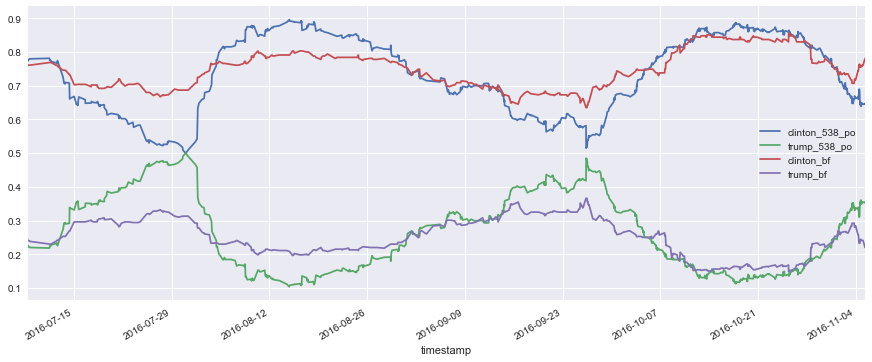
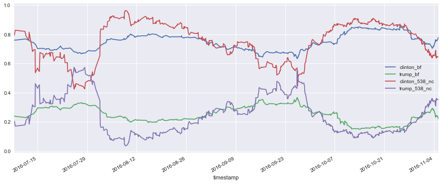
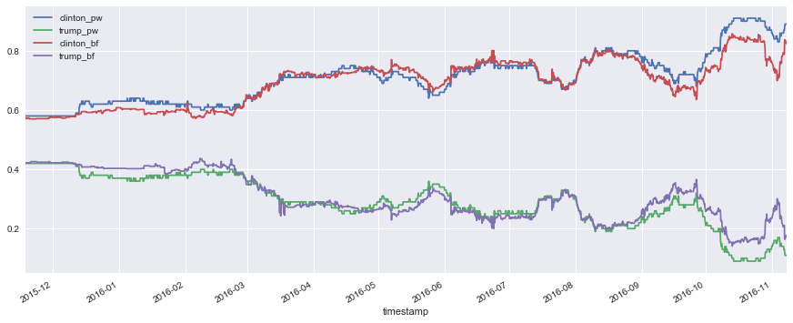
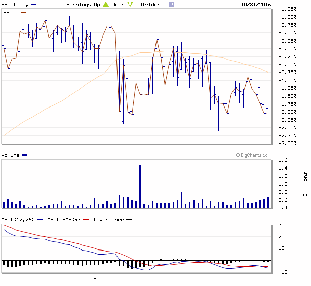

## Prediction Markets

In the final stretch leading up the U.K’s referendum on the EU last year, traditional opinion polls suggested an extremely close race, fluctuating between staying in the EU and leaving up until the votes were cast. However, the political prediction (betting) markets told a different story, showing a wide lead on the odds of remaining. Two days before the referendum, a large number of opinion polls showed ‘Leave’ ahead, while the British prediction market Betfair was implying odds of 75 percent for ‘Remain’ and 25 percent for ‘Leave.’

In the end, opinion polls proved to be more accurate than the political betting markets-- ‘Leave’ won 52% to 48%. In their defense, bettors did not say a ‘Remain’ win was a certainty. Indeed, the odds implied ‘Leave’ would win on one of four occasions, and that was the occasion. 

[The logic of prediction markets](http://www.nature.com/news/the-power-of-prediction-markets-1.20820) is based on the idea that real-money markets can serve as more efficient and accurate indicators of how the election would swing, without the biases that plague traditional opinion polls. It’s a mini Wall Street for politics. Prediction markets can also be used to make forecasts for all kinds of events, from the outcomes of horse races to the results of business decisions. In the world of politics, what are the gamblers assessing? Are they looking at the same poll as everyone else? 

As we got closer to the U.S. Presidential election, there was a similar discrepancy between opinion polls and prediction markets. A snapshot from November 4 shows that prediction markets like Betfair used in PredictWise displayed an overwhelming belief that Clinton would win the next presidency, while opinion polls were mixed. On 6 November 2016, two days before the election, [FiveThirtyEight](https://fivethirtyeight.com/)’s models converged around 65% for a Clinton victory, while [David Rothschild’s PredictWise](http://predictwise.com/) had Clinton’s chances of winning at 88%.

On the morning of Election Day, RealClear Politics showed that polls stood at 45.3 percent for Clinton and 42 percent for Trump-- a very close race. Meanwhile, PredictWise showed that prediction markets such as Betfair and PredictIt had given an 89 percent likelihood that Clinton would win and an 11 percent likelihood for Trump. 

Despite the discrepancy between the prediction market Betfair, where people bet on the candidate winning a majority in the Electoral College, and the market performance aggregator PredictWise, both displayed an overwhelming belief that Clinton would take the next presidency. 

There are various explanations to why the models diverged so much. Each model weighs polls differently, uses economic indicators, correlates state polls with neighboring states or uses current betting numbers. Given that the election is now over, we can evaluate the differences between these prediction models.

While both polls and betting markets are neither perfect, overconfidence in betting markets can make the markets look misleadingly stable, and that false sense of stability makes it harder for them to predict events that shake up the status quo. PredictWise’s founder, David Rothschild, even pointed out, “prediction markets have arrived at a paradoxical place: There reliability, the very source of their prestige, is causing them to fail.” Another thing to note is that the [political betting market is a relatively small niche](http://www.cnbc.com/2016/07/28/political-polls-vs-betting-markets-heres-why-they-conflict.html), despite having grown in popularity in recent years. Also, there might be [a relatively similar mindset among betters](http://www.slate.com/articles/news_and_politics/moneybox/2016/07/why_political_betting_markets_are_failing.html) generally. 
 
While most major polls and prediction markets had been forecasting a Clinton on the morning of Election Day, a few outliers told a different story. One outlier was the S&P 500 stock market index, which stock market has been historically reliable at predicting the US Presidential election. Developed by S&P Global Intelligence, the index looks at how the stock market performs from August 1 to October 31st—a critical three-month period leading up to the election. If stocks rise during this time, it favors the incumbent party.  If stocks showed a negative performance, the challenging party wins the election 86 percent of the time. The basic idea behind these betting markets that if the economy is doing well and, people are more likely to advocate for the same presidential party (so in last year’s case, the Democrats). If stocks tend to fall, voters would want new leadership. The only times that the stock market predictor didn’t work were in years where a strong third party candidate was involved (e.g. 1968 or 1980) or where there was a surprising geopolitical shock like in 1956 when England and France seized the Suez Canal from Egypt. 

<i>Custom chart generated from MarketWatch.com showing the stock market performance from August 1 - October 31, 2016: [http://www.marketwatch.com/investing/index/SPX/](http://www.marketwatch.com/investing/index/SPX/)</i>

When the Director of the FBI, James Comey, announced an investigation over Clinton’s new trove of emails, the S&P 500 slumped 3 percent over 9 trading sessions. Although the nine-day market descent gained impetus following the Oct. 28 bombshell announcement, the overall market performance from July 31st to October 31st is what matters most. The S&P 500 Index declined by 4.5 percent, which translated into an 86 percent chance of Trump’s winning on Election Day.

Accompanying the downdraft was a surge in the so-called fear gauge, aka the CBO Volatility Index or VIX, which measures implied volatility for the S&P 500 over the next 30 days.  Once Comey cleared Clinton in late October, the VIX climbed from 13 to 22 from Monday October 24 to Friday October 28, but slumped back down to 18.7 on Monday Oct 31.

Nonetheless, the correlation between the index’s performance and the outcome of the election lacks sufficient empirical evidence. There have been too few elections since 1944 to make the S&P 500 Index statistically significant.

(Image source: [https://www.bloomberg.com/news/articles/2016-09-30/this-chart-predicts-trump-will-win-unless-the-s-p-rallies-in-october](https://www.bloomberg.com/news/articles/2016-09-30/this-chart-predicts-trump-will-win-unless-the-s-p-rallies-in-october))

Indeed, [economists found not no correlation](https://www.economy.com/getlocal?q=01B8E0B9-03AE-4574-94E5-FE36F4D0D9B5&app=download) between the stock market and Trump’s strength in the prediction markets.

