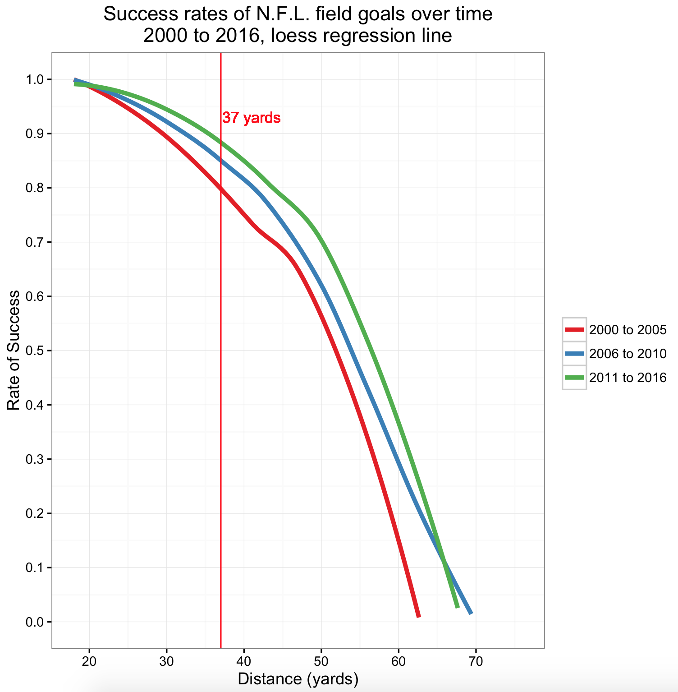
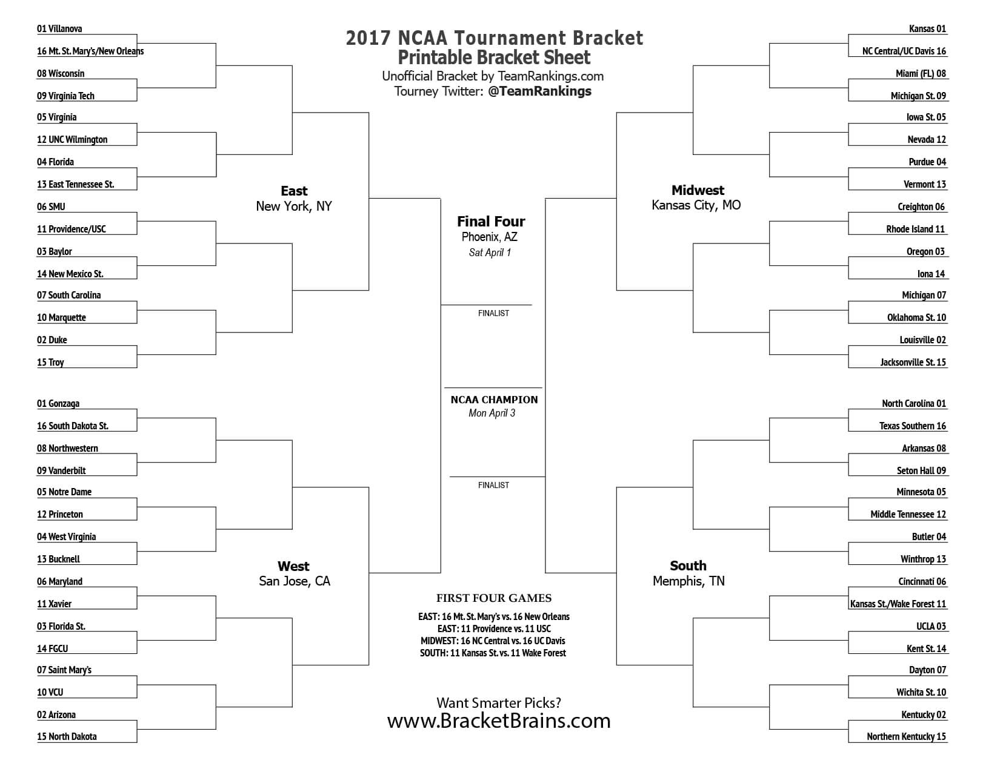

## Sports metaphors and probability: Thoughts from a non-sports enthusiast

On the eve of Election Day 2016, FiveThirtyEight’s final ["polls-only" forecast](https://projects.fivethirtyeight.com/2016-election-forecast/) gave Donald Trump a 29 percent chance of winning the presidency. The NYT Upshot’s model [gave him](https://www.nytimes.com/interactive/2016/upshot/presidential-polls-forecast.html) a 15 percent chance. According to these two probabilities, a Hillary Clinton victory was likely (a 71 percent and 85 percent chance, respectively), though not a given.

But probabilistic uncertainty is not well-understood. Many people [treated](https://fivethirtyeight.com/features/there-really-was-a-liberal-media-bubble/) Clinton’s win as a foregone conclusion, and they were [shocked](https://www.nytimes.com/2016/11/16/upshot/presidential-forecast-postmortem.html) when Trump won instead.  

The problem, in part, is one of communication.

Here are some ways I’ve seen probabilities translated into real-world examples (emphasis mine):

> "Mrs. Clinton's odds were about **the same as making a 37-yard field goal** in an N.F.L. game," wrote the Upshot’s Nate Cohn, in a piece that came out a few days after the election on ["Why Trump Won."](https://www.nytimes.com/2016/11/10/upshot/why-trump-won-working-class-whites.html)

> "People don't think it's odd **when a 12-seed upsets a 5-seed** in the N.C.A.A., but somehow they think that it's completely topsy turvy if a 30 percent candidate [e.g., Trump in the FiveThirtyEight forecast] wins in 2016," The Economist’s Idrees Kahloon said to me, during a [conversation](https://dataskeptic.com/blog/polling/2017/the-economist-talks-election-forecasting) about their French election forecasts.

> "We said that Trump’s going to happen about one out of every three times. That’s a lot. That’s **Dustin Pedroia getting a base hit,**" said FiveThirtyEight’s Nate Silver, at Harvard’s election post-mortem [conference](https://soundcloud.com/harvardiop/interview-nate-silver#t=10:52).

Unfortunately, sports analogies like these are inscrutable to people like me.

I don’t know much about sports. Prior to writing this post, I didn’t know how N.F.L. field goals worked, what it meant to be a "12-seed"[^1], or who Dustin Pedroia was. 

So I asked some of my friends to help me out. Over the course of several discussions (and a weekend of obsessive Googling), here’s what I learned about sports, and what I think about comparing sports outcomes to election results.

*As an N.F.L. kicker, a 37-yard field goal is something you'd be expected to be able to make. But sometimes, you miss.*

In football, you earn points as a team by making a touchdown or a field goal. A touchdown (6 points) is when a team gets the ball all the way to the endzone—the painted area of grass at the other end of the field. A field goal (3 points) is when someone kicks the ball through the goal post, located at the back of the endzone.

The farther away from the endzone you are, the harder it is to make a field goal.

If you score a touchdown, you get the chance to earn an extra point by scoring a field goal 25 yards away from the endzone. In the N.F.L., this extra point is practically a given, because a 25-yard field goal is rarely missed.[2]

Now to Nate Cohn’s analogy.

IIf a 25-yard field goal is super easy for a kicker to make, then what about a 37-yard one? It’s pretty easy. "If you're in the N.F.L. and you're a kicker, you can definitely hit 37 yards," said my roommate Collette and her friend Clara, after I co-opted their Friday night to grill them about sports.

Still, you could miss. Maybe it's windy, or maybe the other team "gets in your head." A goal from 37 yards away[^3] is also within "a range where it would be easy to be overly confident," they told me.

Cohn compares the probability of an N.F.L. kicker scoring such a goal to the Upshot’s final forecast for the probability of a Clinton win, 85/100. Numbers-wise, this looks about right, according to  N.F.L. stats from 2000 to 2016:

*Source: Mike Lopez, via nflscrapR package in R and Advanced Football Analytics*

 

Note the relationship between distance and success rate is non-linear. For instance, the likelihood of making a 37-yard field goal is less than half the likelihood of making a 25-yard one. Plus, because [kickers are getting better](https://fivethirtyeight.com/features/kickers-are-forever/), the "expected" probability of success for a 37-yard field goal nowadays is closer to 90 percent than to 85 percent:

 

*During the N.C.A.A. College Basketball Tournament, aka March Madness, a 12-seed team plays a higher-ranked team, a 5-seed team (think of a “seed” as a rank). The 12-seed is not favored to win (that’s called an “upset”)—but it sometimes does, and it’s a well-known upset.*

The N.C.A.A. hosts an annual nationwide college basketball tournament. The men’s competition is called March Madness, with 68 qualifying teams. To simplify, let’s eliminate 4 teams and skip to the Field of 64.

The tournament is played in four regions. Each of the teams gets ranked and then distributed across regions (16 teams per region); this is called “seeding.”[4] So the top four teams are known as “1-seeds” (one for each region), the next four are “2-seeds,” etc. The order of play is visualized on a bracket sheet.

*Source: [Teamrankings.com](https://www.teamrankings.com/ncaa-tournament/)*

In a 1-seed vs. 16-seed game, the 16-seed will virtually never win, since 1-seeds are the highest-ranked and 16-seeds are the lowest (it has never happened before). Same with 2-seeds v. 15-seeds; Middle Tennessee’s win over Michigan State this year was only the [eighth time](http://apps.washingtonpost.com/sports/apps/live-updating-mens-ncaa-basketball-bracket/search/?from=1985&game_type=1&opp_bid_type=&opp_coach=&opp_conference=&opp_power_conference=&opp_school_id=&opp_seed_from=15&opp_seed_to=15&pri_bid_type=&pri_coach=&pri_conference=&pri_power_conference=&pri_school_id=&pri_seed_from=2&pri_seed_to=15&submit=&to=2017) it’s ever occurred.

But as you go down the line, upset victories become more likely, since the gap between the opposing teams’ rankings narrows. 5 vs. 12 is the "sweet spot"—an upset has occurred every year [since 2007](https://www.washingtonpost.com/news/early-lead/wp/2015/03/16/a-no-12-seed-always-upsets-a-no-5-seed-in-the-ncaa-tournament-who-will-it-be-this-year/).

The 5-12 upset has become somewhat of a cultural phenomenon; my friends who fill out brackets with their predictions always put down at least one 12-seed upset.

Idrees Kahloon’s point is that a 12-seed upset is unlikely, but not at all unthinkable—like a Trump victory. According to the data, 12-seeds have won against 5-seeds in [36 percent](http://apps.washingtonpost.com/sports/apps/live-updating-mens-ncaa-basketball-bracket/search/?from=1985&game_type=1&opp_bid_type=&opp_coach=&opp_conference=&opp_power_conference=&opp_school_id=&opp_seed_from=12&opp_seed_to=12&pri_bid_type=&pri_coach=&pri_conference=&pri_power_conference=&pri_school_id=&pri_seed_from=5&pri_seed_to=5&submit=&to=2017) of games played, slightly higher than FiveThirtyEight's forecast of Trump's chances.

The comparison is "valid for sure," said my friend Maya. Still, "the excitement of March Madness is sort of built on an expectation of upsets," she pointed out.

**A “base hit” (or “hit”) in baseball is when you hit the ball and safely get onto a base or get a home run (i.e., you hit it outside of the field). Dustin Pedroia is a hitter for the Boston Red Sox, whose overall batting average — hits as a proportion of times at-bat — is [.301](http://www.espn.com/mlb/player/stats/_/id/6393/dustin-pedroia)”**

As my friend Joe put it, nobody watching a game would think it remarkable if Pedroia got a hit, since he’s a great player. But he doesn’t get one during [every game](http://www.baseball-almanac.com/players/hittinglogs.php?p=pedrodu01&y=2016), and his batting average is only about one in three. In other words, one in three times is very different from "never." Nate Silver’s point is that a one in three chance of a Trump win is no small chance.

 
~
 

Probabilistic forecasts are difficult to understand. Sports analogies make them easier—but not for everyone. Even after my crash course in our three favorite national pastimes, sports analogies still don’t quite speak to me (I am, of course, not the intended audience).[^5]

Not every explanation of probability I encountered was a sports analogy. There are some examples that would likely resonate with a wider audience. Like this one from Nate Silver, speaking on FiveThirtyEight’s Politics [podcast](https://fivethirtyeight.com/features/model-talk-debriefs-the-2016-results/):

> "If we had said there was a 30 percent chance of an earthquake hitting Seattle, and everyone said, 'You guys are a bunch of idiots; it's a 1 percent chance,' and then an earthquake hits, you can’t then turn around and say, 'Well, you did say there was a 70 percent chance there wouldn’t be an earthquake', you know?"

Other examples could click with a different audience, if not a wider one. The stats-inclined, for instance, would appreciate this point from David Byler of Real Clear Politics, via [Sean Trende](http://www.realclearpolitics.com/articles/2016/06/28/trump_brexit_and_the_state_of_the_race_131036.html):

> "If you toss a coin twice and get a head, then a tail, an outcome with just a 25 percent chance of happening just occurred."[^6]

The NYT’s Josh Katz used a similar example in a [newsletter dated Nov. 1](http://www.nytimes.com/newsgraphics/2016/11/01/presidential-forecast-updates/newsletter.html): 

> "For an amusing experiment, you can try this at home. Go find a coin. Flip it three times. If it comes up heads each time, Mr. Trump will be America's next president ..."

Finally, there is a larger issue I haven’t yet mentioned: none of these examples is a perfect stand-in for election forecasts, because the types and sources of error are different between election outcomes and sports outcomes (and between election outcomes and the weather, or coin tosses). Think about it this way: if a favored team loses a game, it’s likely because of outside factors, like [player injury](http://grantland.com/features/the-footnote-title/), factors that you’d be hard-pressed to quantify in your forecasting model. But if a favored candidate loses an election, it’s likely because of things in your model that were incorrectly measured, like [polling misses](https://www.nytimes.com/interactive/2016/11/13/upshot/putting-the-polling-miss-of-2016-in-perspective.html) or [underperforming turnout models](https://fivethirtyeight.com/features/the-polls-missed-trump-we-asked-pollsters-why/). The two errors are not the same.[^7] 

What’s more, there’s a lot more disagreement when it comes to elections. "You could ask any one of several dozen football researchers [about field goal predicted probabilities] and they’d be likely to give you estimates within a few percentage points," said [Mike Lopez](https://twitter.com/StatsbyLopez), an assistant professor of statistics at Skidmore College. In contrast, even in the final days before the election, when forecasts (and polls) tend to converge, the FiveThirtyEight and the Upshot models were the more conservative ones, [compared to other forecasts ](https://www.nytimes.com/interactive/2016/upshot/presidential-polls-forecast.html#other-forecasts) showing a greater than 90 percent chance of a Clinton win. 

Baked into these analogies is a false equivalence between sports uncertainty and political uncertainty. It is an issue that Nate Cohn [acknowledged](https://www.nytimes.com/2016/11/10/upshot/why-trump-won-working-class-whites.html) in his write-up, though he says the overall point—that a low-probability event is not impossible—is ultimately more important.

There is of course another possibility in all this: the models could all have been very wrong. Until we have more data points (i.e., presidential elections), [it’s hard to tell](https://www.nytimes.com/2016/11/16/upshot/presidential-forecast-postmortem.html).

Either way, I don’t think we’d be worse off if we’re a little more uncertain and a lot more discerning the next time we encounter probability. 

[^1]: Case in point: when I transcribed our interview, I wrote down "12-*seat*" rather than "12-*seed*."

[^2]: Most [rates of success](http://www.espn.com/nfl/statistics/team/_/stat/kicking) for 25-yard field goals are in the 90 percent to 100 percent range.

[^3]: Assuming Cohn means 37 yards as the distance from the back of the endzone, where the goal post is. Field goal distances are [confusing](http://dearsportsfan.com/2015/09/22/what-is-field-goal-range-how-is-field-goal-distance-measured/) (note how I avoid discussing yard lines).

[^4]: Regions are just where the games are played, not where the teams are from. The [ranking process](http://www.ncaa.com/news/basketball-men/article/2017-03-12/march-madness-bracket-how-68-teams-are-selected-division-i) is its own [can of worms](https://fivethirtyeight.com/features/the-ncaa-is-modernizing-the-way-it-picks-march-madness-teams/).

[^5]: Though it’s nice to actually “get” the sports references in posts like [this one](https://fivethirtyeight.com/features/the-super-bowl-wasnt-really-like-the-election/): “if a 16-seed wins the N.C.A.A. tournament, I’ll be ready to conclude that the people who designed the Planet Earth simulation are just toying with us.” 

[^6]: With independent coin tosses, probability of heads then tails = probability of heads (0.5) * probability of tails (0.5) = 0.25.

[^7]: In stats lingo, the difference between omitted variable bias and measurement error. Though in the 2016 election, the [Comey](https://fivethirtyeight.com/features/how-much-did-comey-hurt-clintons-chances/) factor is worth considering.