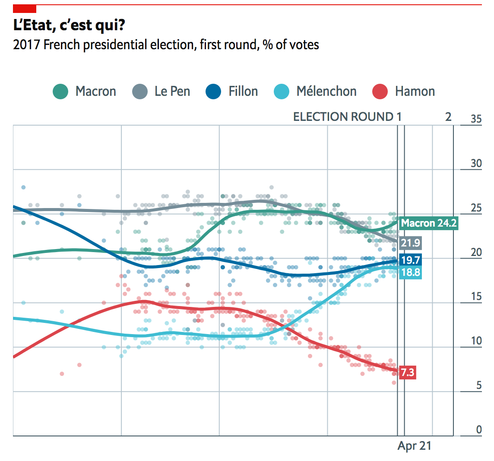
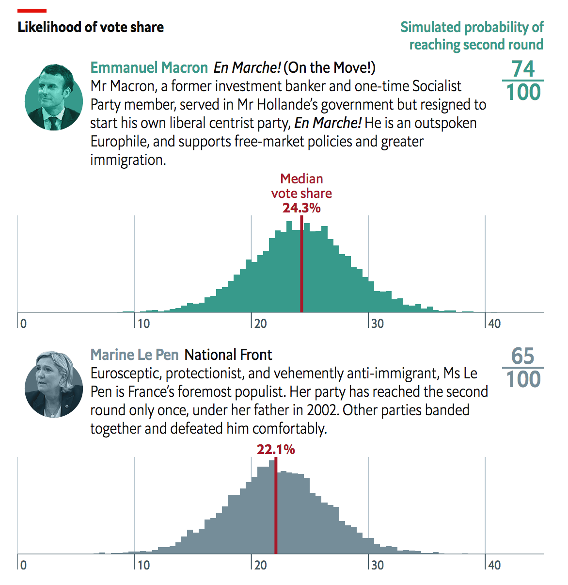

## The Economist talks election forecasting

> EDITOR'S NOTE: Late in 2016, as the US election results came in and left many onlookers claiming that the polls "got it wrong", Data Skeptic promised that we'd cover the topic of polling after some time had passed.  This post kicks off our week long coverage of election polling, culminating in a podcast on the subject this Friday.

----

For a publication that ["resisted the temptation"](http://www.economist.com/blogs/democracyinamerica/2016/11/covering-trump-0) to issue forecasts during the 2016 U.S. election, <i>The Economist</i> sure picked a hell of a time to start when it decided to model the [French presidential vote](http://www.economist.com/blogs/graphicdetail/2017/04/daily-chart-5).

In the newspaper's [own words](http://www.economist.com/news/briefing/21721134-high-stakes-and-close-race-french-election-unprecedented-all-sorts-ways), "this French election is unprecedented in all sorts of ways."  The two front-runners in April 23rd’s first round of voting are the centrist outsider Emmanuel Macron, who has never before held elected office, and Marine Le Pen, leader of the far-right, anti-immigrant Front National party. At the time of writing (April 21st), <i>The Economist</i>'s model favors the two facing off in a final round on May 7th, but places Le Pen's ultimate chances of victory during the second-round in the single digits.

Meanwhile, the incumbent president, the “mainstream” left’s François Hollande, is so unpopular he has decided not to seek re-election; his party's candidate, Benoît Hamon, is unlikely to make it past Sunday. The far-left’s Jean-Luc Mélenchon has won the support of voters at odds with Macron’s pro-business, pro-Europe stance. On the “mainstream" right, François Fillon—the closest thing to an “establishment” candidate in this race—is still recovering from a scandal involving payments to his wife; he is polling roughly the same as Mélenchon. Either or both could very well make it to the second-round. 

Friday’s attack in Paris has cast further uncertainty onto an already volatile race. 

In such an unpredictable election as this, is there the point to making predictions? I recently spoke to Idrees Kahloon, a data journalist at <i>The Economist</i>, about their forecasting model.

<b>Why build an election forecasting model for France, when <i>The Economist</i> didn’t do one for the U.S.?</b>

“There were already a lot of players in the game of modeling the U.S. election,” and <i>The Economist</i> wasn’t eager to add another voice to the fray, according to Kahloon.

Not so for the French election. Many French newspapers shy away from averaging polls, to say nothing of forecasting outcomes: [Le Monde](http://www.lemonde.fr/les-decodeurs/visuel/2017/03/07/sondages-parrainages-meetings-temps-de-parole-quatre-indicateurs-pour-suivre-la-campagne-presidentielle_5090550_4355770.html#meter_toaster) publishes individual results from three pollsters in three separate graphs for the first-round; [Le Figaro](http://www.lefigaro.fr/elections/presidentielles/2017/04/18/35003-20170418ARTFIG00148-presidentielle-les-derniers-sondages.php) does the same but for eight; [Paris Match](http://www.parismatch.com/La-presidentielle-en-temps-reel) and [Les Echos](https://www.lesechos.fr/elections/presidentielle-2017/0211739192332-sondage-le-suivi-quotidien-de-la-presidentielle-2062937.php) each sponsor a poll and publish first- and second-round results from just that poll. Among the international papers, [Bloomberg](https://www.bloomberg.com/graphics/2017-french-election/) averages polls for the first-round and the [Financial Times](https://ig.ft.com/sites/france-election/polls/) does for the first- and second-rounds, but both stop short of making predictions.

By contrast, [The Economist](http://www.economist.com/blogs/graphicdetail/2017/04/daily-chart-5) calculates each candidate’s chances of victory, based on polling data. “This was a place where we could really add value” by assigning a probability to each outcome, said Kahloon.

<b>But can we trust the polls?</b>

Nowadays, it’s “fashionable” to dismiss polls, Kahloon said. What’s more, “people think that bad things must happen in threes. There was Brexit, there was Trump, and now there must be Le Pen.” 

But in the case of Brexit and Trump, a lot of polls weren’t actually that far off. On the national level, there was a [larger polling error](https://twitter.com/NateSilver538/status/796411118302302208) in the U.S. in 2012 than there was in 2016. Much of the problem was in interpretation or, in Kahloon’s opinion, faulty models, like those that gave Donald Trump a less than 1% chance of winning on the eve of Election Day.

“The alternative to trying to forecast the future without using quantitative means like polls is trying to forecast the future using kind of basic punditry,” he said. “With quantitative estimates ... if you make a prediction, you are then held accountable to it.”

How does The Economist’s model work?
 
The fact that The Economist’s latest projection has given Le Pen such a low chance of winning has caused some [heads to turn](https://twitter.com/ianbremmer/status/855349007350104065). How did they come up with each candidates’ win probabilities?

The team starts by calculating a moving average of each candidate’s vote share, according to reputable election polls conducted throughout 2017, weighted by sample size. This moving average is the basis of the trendlines shown in the chart, which is updated daily:

Then, they use a database of French election polls compiled by political scientists Christopher Wlezian and Will Jennings to calculate the historical error of polls leading up the actual election. Polls are generally more accurate in estimating the winner’s margin of victory as Election Day approaches.

To simplify, take the example of a two-candidate race, as in the U.S. Say that Hillary Clinton is leading Donald Trump by five points 30 days before the election. On average, how much have U.S. opinion polls taken 30 days before the election been off by, in terms of estimating the winner’s margin of victory? What is the standard deviation around this error? Now, using the mean and standard deviation, we could draw a t-distribution centered around the error. If the polls 30 days prior to Election Day show Trump behind by five points, they would have to be “off” by more than five points in order for him to be the winner. What is the probability of this happening, given the t-distribution of the historical error? That probability would be Trump’s “win probability” (Clinton’s would be the inverse). Repeating this process several thousand times allows us to simulate both candidates’ chances for that day.[1] 

The process for multiple candidates (in the first-round) is [slightly more involved](http://www.economist.com/blogs/graphicdetail/2017/04/election-forecasting), requiring a multivariate normal rather than a univariate normal distribution (the team had experimented with a Dirichlet distribution and a vector autoregression model, but “couldn't get it to behave,” said Kahloon), but that’s the general idea. Visually, they plot out the distribution of likely outcomes on Election Day for the five main first-round candidates:

“This is, we think, the simplest way you could do it,” Kahloon told me.

<b>What about undecided voters? And other considerations?</b>

<i>The Economist</i>’s “bare-bones” foray into election modeling, as well as the unusual characteristics of this particular election, leave some things unaccounted for. For example, the model doesn’t calculate “house effects”—the tendency for pollsters to favor one party over another—in large part because Macron is running under a party that he formed himself just last year (there is no “house effect” for a party that has never existed before). Nor does it rate pollsters, or take into consideration whether a poll is telephone-based, online, or mixed-method. Also, because it uses only the topline numbers from the polls, it does not take into account voter indecision or demographic information.

Another issue that has come to light is the phenomenon of herding; in recent weeks, pollsters have produced [similar numbers](http://www.economist.com/blogs/graphicdetail/2017/04/daily-chart-13) for the first-round candidates. “It’s hard to tell” from the data whether or not this apparent convergence is actually a problem, in Kahloon’s opinion. The second-round probabilities actually show “significant divergence” from poll to poll, he said.

<b>“This time is different”</b>

It’s hard to get around the fact that this is, in Kahloon’s words, “an exceptionally weird election.” But he doesn’t necessarily believe that this means the polls are systematically wrong. Besides, “it's really easy to say, 'don't under-value the unlikely view,'” he says. “If the unlikely thing doesn’t happen, it was unlikely anyway, and if it does happen you look good.” 

One thing *is* different: unlike with Brexit or Trump, the polls are *not* showing a close race between Le Pen and her opponent in the second-round. For example, she is down 20 points to Macron “in basically every single poll,” according to Kahloon. “A 20-point polling error would be unheard of, at least to me.”

“You can always come up with a worst-case scenario, but at the end of the day I think you should take what the data is showing you, and you should report it correctly.”

<i>The Economist</i> is planning on modeling the German and Dutch elections and making much of their work available to the public later this year.

[1] The Economist used a similar procedure for this [blog post](http://www.economist.com/blogs/graphicdetail/2016/10/daily-chart-14) during the 2016 election. Thanks to Jeff, John, and Alex for talking me through it.

