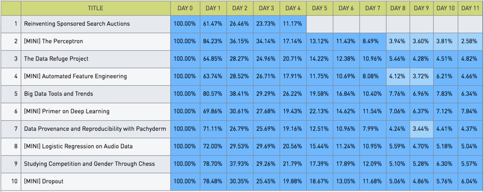

## Periscope Data Cohort Charts

Data Skeptic releases every Friday morning.  It will come as no surprise that the majority of downloads for any episode happen the first day.  With very few exceptions, the Nth day a show is available, it receives the Nth largest number of downloads it will get.  Listeners demand new content!

I've been meaning to look at how each episode decays.  Perhaps I can learn about what content is preferred by the audience.  I might even be able to measure how word of mouth has kept the interest (as measured by downloads) high in one episode over another.

We have a system that inserts all our stats into a mysql database.  The table captures the number of downloads per episode per day.  Thus, it's very easy for me to write a query to answer a question like "How many downloads has the most recent episode gotten in the last five days?"

However, a much harder question is, how do the most recent episodes compare to each other in terms of the decline in downloads?

I'd been putting off looking into this important bit of analytics simply because it was going to take me a little time to do the non-trivial data munging to answer the question.  However, all that changed when I discovered PeriscopeData's cohort grid option.

The cohort grid works like an Excel Pivot table.  I could have done my analysis in Excel, but with [Periscope Data](https://www.periscopedata.com/skeptics), the charts are always up to date and can be scheduled for delivery to my inbox every morning.

My use case took me less than a minute to set up.  I've included an example screenshot at the bottom of this post.  Although my stats are relatively consistent, in other uses of this chart type, I've found the background coloring to be a lifesaver in reading magnitudes (by intensity of color) in what would otherwise be a sea of digits.

There are more advanced features available for this chart type as well.  Although I didn't need it, I'm impressed with the nested hierarchy that is available.  If I were plotting sales data, I could organize it by region, state, and regional office with almost no additional effort.

This chart type is also good for schedules and monitoring (time of day as rows, day of week as columns).  Many data warehousing applications benefit from this type as well, reporting facts in cells across two or more different dimensions.

In the screenshot below, you can see the most recent 10 episodes of Data Skeptic and how many downloads they got indexed against the day of release.  Because I wanted to study the decay and release days always see the maximum downloads per day, I divided all days by that max to normalize the data.  This way episodes can be compared against each other.  When I review this data, it's interesting to note episodes like "[MINI] The Perceptron" and "Big Data Tools and Trends" not only have great showing on the 1st day after release, but they continue to outperform other episodes.  This has now got me thinking about why those episodes were more popular than others.  When displayed this way, the trends I hadn't seen before are much more obvious.

Check it out for yourself at [https://www.periscopedata.com/skeptics](https://www.periscopedata.com/skeptics).

