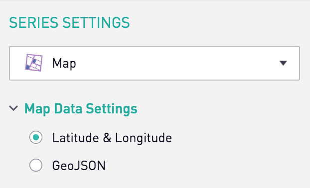
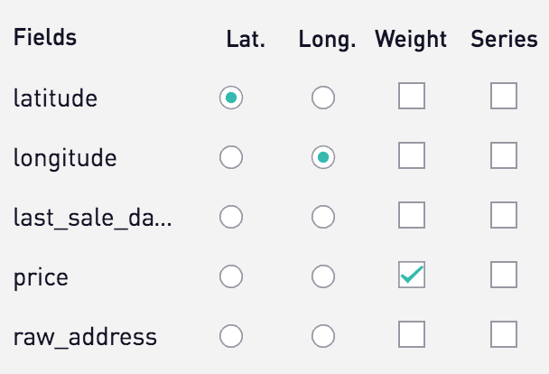
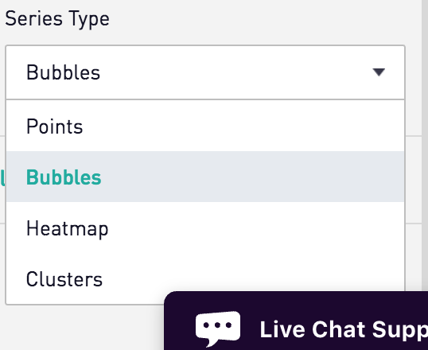

## Periscope Data Maps

On the [OpenHouse](https://dataskeptic.com/episodes/2017/openhouse) episode of Data Skeptic, I mentioned the mapping charts that are available to include in  Periscope Data dashboards.

Below is a screenshot of a recent one I made.  Take a look at it and then below I'll explain the map and how I created it.


There's a particular set of properties I was doing some analysis on which I download from the Open House API and loaded to a MySQL database for ease.  I connected that MySQL database to Periscope Data and then proceeded to make a random sample on a map plot of a particular area's home sales data.  The circles center on the home they describe and their radius is relative to the price most recently paid for that home.

This map is relatively straightforward and has all the interactive features you would expect, including a tooltip popup when you roll over the image.  What's really cool to me is not the map itself, per se, but how easily it is to generate it directly from my data in SQL.

I'll go over the steps I took to create this.

The first step was to develop my query to get the data out of my database.  Below is my query.  I am grouping by latitude and longitude.  I know that multi-unit building will share the same lat/lng, but that's fine for my purposes.  Periscope Data actually has an elegant way of handling it.  When there are multiple records to the same point, they appear in the tool tip as a list.

```
SELECT latitude, longitude

, max(listing_timestamp) as last_sale_date

, max(price) as price

, max(raw_address) as raw_address

FROM open_house_data

GROUP BY latitude, longitude
```

Those of you paying close attention might raise a skeptical eye to the query above.  I'm getting the max `listing_timestamp` as the latest sale date.  I also get the max `price`, which the average viewer will interpret as the price at the last sale date.  If the property has ever declined in value, this won't be true.  That's an important point, but it's a concern for another post.  Let's move on to the chart configuration.

The first thing to do is to select the Map as the chart type.  I then have the option of working with latitude/longitude data or GeoJSON.  My data is in lat/lng.



Periscope Data already figured out my latitude and longitude columns, presumable from the column names.  I checked `price` for the `weight` configuration, since I want the radius of each point to reflect the price.



Next, I'm going to select the Bubbles Series Type.  I think I'll be interested to try Heatmap and Clusters for other projects, but the Bubbles suit this use case well.



That's all there was to it!  I went from SQL query to interactive map in about 20 seconds.  This is ideal for adhoc geographic analysis.  Lastly I can even copy that map to my clipboard with one click, making it a convenient thing to drop in an email or slack message.


If you'd like to learn more about my experience with Periscope Data, check out the video below.

<center><iframe width="560" height="315" src="https://www.youtube.com/embed/aglpJrMp0M4" frameborder="0" allowfullscreen></iframe></center>

<br/><br/><br/>